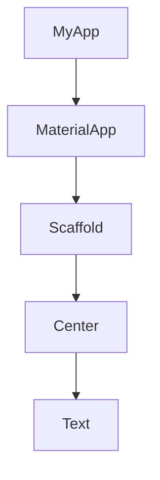
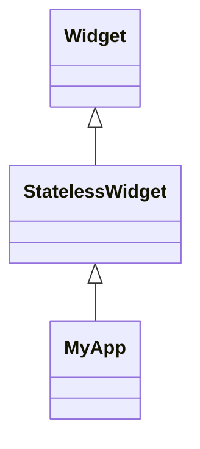
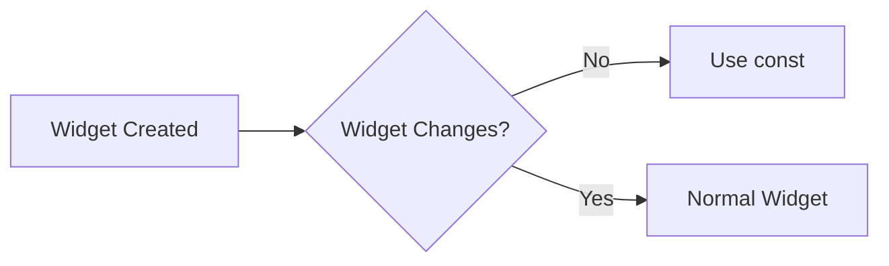

# 🚀 Flutter Day 02 - StatelessWidget & build() Deep Dive

---

# 🎯 Objective

Understand how Flutter creates UI using custom widgets, inheritance, method overriding, and the build() function.

By the end of this day, you should understand:

- Why MyApp is created
- Why StatelessWidget is used
- How build() works
- Why build() returns a Widget
- How Flutter renders UI
- What @override means
- Why const is used

---

# 📚 Topics Covered

- MyApp
- StatelessWidget
- Inheritance (extends)
- Method Overriding
- build()
- BuildContext (Introduction)
- return
- const
- Flutter Rendering Flow

---

# 1️⃣ Why Create MyApp?

Instead of writing everything directly inside `runApp()`, Flutter developers create a custom widget called **MyApp**.

This keeps the code clean, reusable, and scalable.

Instead of:

```dart
runApp(
    MaterialApp(...)
);
```

We write:

```dart
runApp(
    MyApp()
);
```

Now MyApp becomes the root widget of the application.

---

# 2️⃣ StatelessWidget

StatelessWidget is a predefined Flutter widget.

When MyApp extends StatelessWidget, MyApp also becomes a Widget.

```dart
class MyApp extends StatelessWidget
```

Meaning:

> MyApp inherits all widget behavior from StatelessWidget.

---

# 🧠 Java Connection

```java
class Dog extends Animal {

}
```

Flutter

```dart
class MyApp extends StatelessWidget {

}
```

Both use **Inheritance**.

---

# 3️⃣ Why build()?

Flutter knows MyApp is a Widget.

But Flutter still asks:

> "What should I display?"

The answer is the **build()** method.

```dart
Widget build(BuildContext context){
    return MaterialApp();
}
```

build() gives Flutter the UI blueprint.

---

# 4️⃣ Why Widget build()?

```dart
Widget build(...)
```

means

> This function MUST return a Widget.

Valid

```dart
return Text("Hello");
```

Valid

```dart
return MaterialApp();
```

Invalid

```dart
return 10;
```

because Integer is NOT a Widget.

---

# 5️⃣ Why return?

Just like Java returns values,

Flutter returns Widgets.

Java

```java
return 10;
```

Flutter

```dart
return MaterialApp();
```

---

# 6️⃣ @override

StatelessWidget already has a build() method.

We replace that implementation.

```dart
@Override
Widget build(...)
```

Same as Java.

---

# Java Example

```java
class Animal{

    void sound(){

    }

}

class Dog extends Animal{

    @Override
    void sound(){

    }

}
```

Flutter

```dart
class MyApp extends StatelessWidget{

    @override
    Widget build(BuildContext context){

    }

}
```

Both use Method Overriding.

---

# 7️⃣ BuildContext

Today we only learned the introduction.

BuildContext tells Flutter where the widget exists inside the Widget Tree.

We'll study it deeply later.

---

# 8️⃣ const

const tells Flutter

> "This Widget will never change."

Instead of creating unnecessary new objects during rebuilds,

Flutter can reuse immutable widgets.

Example

```dart
const Text("Hello")
```

instead of

```dart
Text("Hello")
```

---

# Important

const helps mostly during **UI Rebuilds**, not only during app startup.

---

# 🧠 const MyApp()

Professional Flutter code usually starts with

```dart
runApp(const MyApp());
```

This makes the root widget immutable (when possible).

It does NOT automatically make every child widget const.

Each widget is evaluated independently.

---

# Mermaid Diagram

```mermaid
flowchart TD

A[main()] --> B[runApp()]
B --> C[MyApp()]
C --> D[build()]
D --> E[return MaterialApp()]
E --> F[MaterialApp]
F --> G[Scaffold]
G --> H[Center]
H --> I[Text]
I --> J[📱 Screen]
```

---

# Widget Tree



---

# Inheritance Diagram



---

# Method Overriding

```mermaid
flowchart LR

A[StatelessWidget]
A --> B[build()]

C[MyApp]
C --> D[@override build()]
```

---

# const Concept



---

# Flutter Rendering Flow

```text
main()

↓

runApp()

↓

MyApp()

↓

build()

↓

return MaterialApp()

↓

home: Scaffold()

↓

body: Center()

↓

child: Text()

↓

📱 Screen
```

---

# 🧠 Mind Map

```text
                    Flutter Day 02
                           │
        ┌──────────────────┼──────────────────┐
        │                  │                  │
    MyApp          StatelessWidget         const
        │                  │                  │
    Root Widget      extends Widget     Immutable Widget
        │                  │                  │
        └──────────────┬───┘                  │
                       │                      │
                    build()                  Rebuild
                       │                      │
                Returns Widget          Performance
                       │
                 MaterialApp
                       │
                   Scaffold
                       │
                    Center
                       │
                     Text
                       │
                    📱 Screen
```

---

# Interview Questions

### Q1 Why do we create MyApp?

To keep the application organized and scalable.

---

### Q2 Why does MyApp extend StatelessWidget?

Because runApp() accepts only Widgets.

---

### Q3 Why is build() required?

Flutter needs a blueprint of what UI to render.

---

### Q4 Why does build() return Widget?

Because Flutter renders Widgets only.

---

### Q5 What is @override?

It replaces the parent class implementation.

---

### Q6 Why use const?

To allow Flutter to reuse immutable widgets during rebuilds and avoid unnecessary object creation.

---

### Q7 Does const MyApp() make every child widget const?

No.

Every widget is checked independently.

---

# ✅ Day 02 Summary

Today we learned how Flutter creates UI.

We understood that MyApp is a custom widget, StatelessWidget provides widget behavior, build() returns the UI, @override replaces the parent implementation, and const improves performance by allowing immutable widgets to be reused during rebuilds.

---

# 🚀 Day 03 Preview

Tomorrow we'll start building actual UI.

Topics:

- 🟦 Container
- 📏 width
- 📐 height
- 🎨 color
- 📦 padding
- 🎯 alignment

Tomorrow you'll create your first real Flutter layout instead of displaying only text.