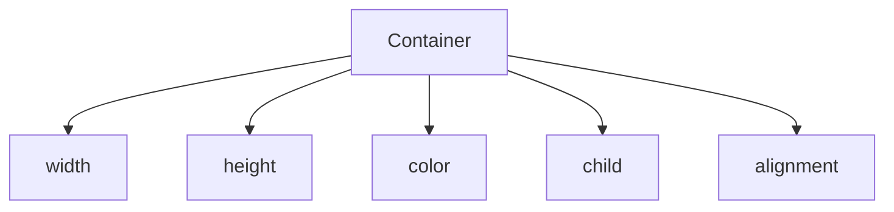
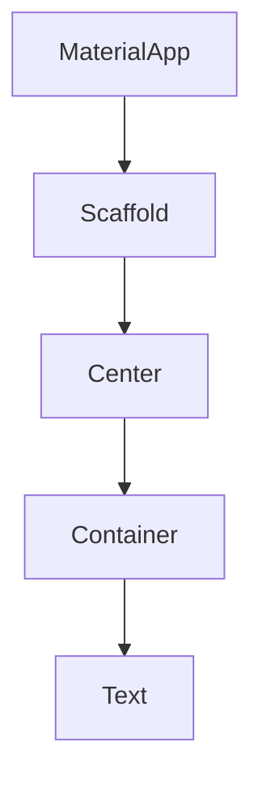
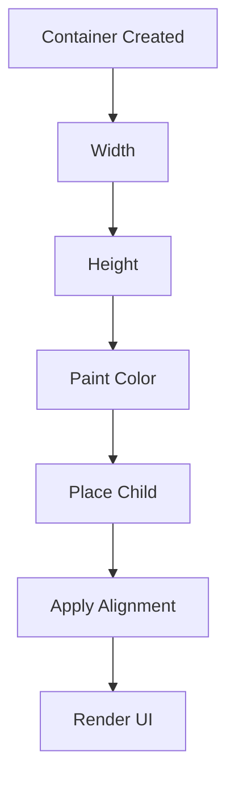
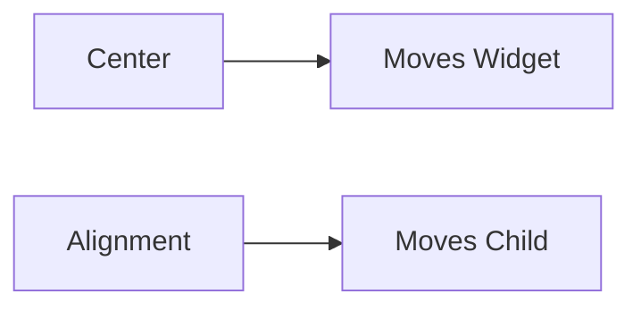

# 🚀 Flutter Journey - Day 03 Notes

**📅 Day:** 03

---

# 🎯 Objective

Learn the Container widget and understand how Flutter creates structured UI using size, color, child, and alignment.

By the end of this lesson you should understand:

- Why Container exists
- Why width & height are needed
- How color works
- What child means
- Why alignment exists
- Difference between Center and alignment
- When to use Container
- When NOT to use Container

---

# 📚 Topics Covered

- Container
- width
- height
- color
- child
- alignment
- Center vs Alignment
- Professional Usage

---

# 1️⃣ What is Container?

Container is a Flutter Widget used to provide:

- Space
- Size
- Background Color
- Alignment
- Child Positioning

Think of it as an empty box.

Real Life Example

```
📦 Amazon Box

↓

Phone
Book
Laptop

Anything can be placed inside.
```

Flutter

```
Container

↓

Text
Image
Button
Icon
```

---

# WHY was Container created?

Question

Can Text() alone create a colored box?

Answer

❌ No.

Text only displays text.

It cannot provide:

- width
- height
- background color
- alignment

Flutter created Container to solve these problems.

---

# 2️⃣ width

Defines horizontal size.

Example

```dart
Container(
  width: 200,
)
```

---

# 3️⃣ height

Defines vertical size.

Example

```dart
Container(
  height: 100,
)
```

---

# 4️⃣ color

Paints the available area of the Container.

Example

```dart
Container(
  width: 200,
  height: 100,
  color: Colors.deepOrangeAccent,
)
```

Important

Color needs space.

Without width or height, there may be nothing visible to paint.

---

# 5️⃣ child

Container can hold only ONE Widget.

Example

```dart
Container(
  child: Text("Hello"),
)
```

Examples of child

- Text
- Icon
- Image
- Button
- Another Container

---

# 6️⃣ Default Child Position

Without alignment

```dart
Container(
    child: Text("Hello")
)
```

Default Position

```
┌──────────────┐
│Hello         │
│              │
│              │
└──────────────┘
```

The child is placed at the **Top-Left** by default.

---

# 7️⃣ alignment

Moves the child INSIDE the Container.

Example

```dart
Container(
    alignment: Alignment.center,
    child: Text("Hello")
)
```

Output

```
┌──────────────┐
│              │
│    Hello     │
│              │
└──────────────┘
```

---

# Different Alignments

Center

```dart
Alignment.center
```

Top Left

```dart
Alignment.topLeft
```

Bottom Right

```dart
Alignment.bottomRight
```

---

# 8️⃣ Center vs Alignment

This is one of the most important Flutter concepts.

Center Widget

Moves the ENTIRE Widget.

Example

```dart
Center(
    child: Container()
)
```

Result

```
Screen

       📦
```

Container moves.

---

Alignment Property

Moves only the child INSIDE the Container.

```dart
Container(
    alignment: Alignment.center,
    child: Text("Hello")
)
```

Result

```
📦

   Hello
```

The Container stays in the same place.

Only the Text moves.

---

# Professional Rule

⭐ Center moves Widgets.

⭐ Alignment moves Children.

---

# Why not always use Container?

Example

```dart
Container(
    child: Text("Hello")
)
```

This is unnecessary.

Better

```dart
Text("Hello")
```

Professional Flutter developers use the simplest widget that solves the problem.

---

# When should we use Container?

✅ Fixed Width

✅ Fixed Height

✅ Background Color

✅ Alignment

✅ Decoration

✅ Border

✅ Border Radius

✅ Shadow

---

# Mermaid Diagram



---

# Widget Tree



---

# Container Working



---

# Center vs Alignment



---

# 🧠 Mind Map

```
                    Container
                        │
        ┌───────────────┼───────────────┐
        │               │               │
     Size            Appearance      Child
        │               │               │
   width height       color        Text/Image/Button
                        │
                  alignment
                        │
              Moves Child Inside
```

---

# Real World Usage

Professionals use Container in

- Login Screens

- Profile Cards

- Product Cards

- Dashboard Widgets

- Notification Cards

- Custom Buttons

- Chat Bubbles

---

# Common Mistakes

❌ Thinking Center and alignment are the same.

❌ Using Container without any purpose.

❌ Forgetting width & height while expecting a visible colored box.

❌ Assuming Container can hold multiple children.

---

# Interview Questions

### Q1 What is Container?

### Q2 Why was Container created?

### Q3 What is the purpose of width?

### Q4 What is the purpose of height?

### Q5 What does child mean?

### Q6 Default child position?

### Q7 Difference between Center and alignment?

### Q8 Can Container hold multiple children?

Answer

❌ No.

Only one child.

---

# Memory Chart

```
Container

↓

Size

↓

Color

↓

Child

↓

Alignment

↓

UI
```

---

# Quick Revision

✅ Container is an empty box.

✅ width controls horizontal size.

✅ height controls vertical size.

✅ color paints the available area.

✅ child holds one Widget.

✅ alignment moves the child.

✅ Center moves the entire Widget.

✅ Use the simplest Widget possible.

---

# Today's Achievement

✅ Learned the first UI Widget.

✅ Built a custom colored Container.

✅ Understood child positioning.

✅ Learned Center vs Alignment.

---

# 🚀 Tomorrow (Day 04)

Topics

- Padding Widget

- EdgeInsets

- all()

- symmetric()

- only()

- Padding vs Margin

- Professional Spacing
