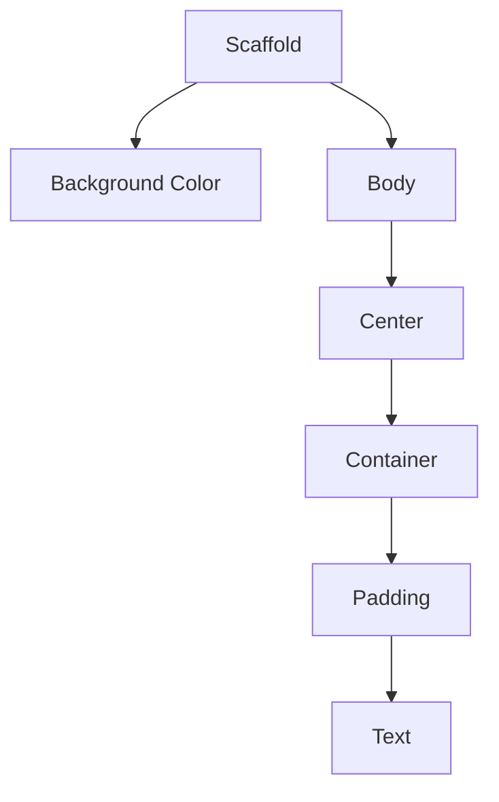
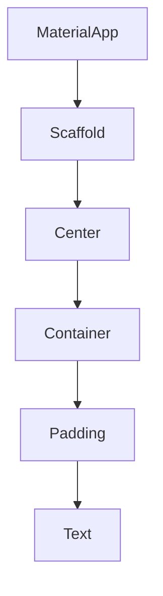
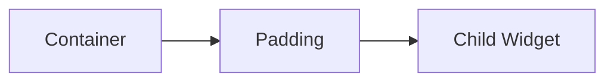
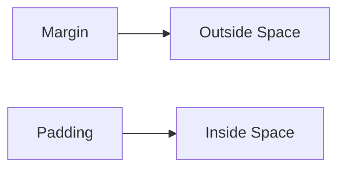

# 🚀 Flutter Journey - Day 04 Notes

**📅 Day:** 04

---

# 🎯 Objective

Learn how Flutter creates beautiful and professional spacing using the Padding widget and understand the difference between Padding and Margin.

By the end of today you should understand:

- Why Padding exists
- What EdgeInsets is
- EdgeInsets.all()
- EdgeInsets.only()
- EdgeInsets.symmetric()
- Padding vs Margin
- Scaffold Background Color
- Professional UI Spacing

---

# 📚 Topics Covered

- Padding Widget
- EdgeInsets
- EdgeInsets.all()
- EdgeInsets.only()
- EdgeInsets.symmetric()
- Margin
- Scaffold.backgroundColor
- Professional UI Spacing

---

# 1️⃣ Why Padding?

Imagine a mobile box.

Without padding

┌──────────────┐
│📱            │
└──────────────┘

Looks cheap.

With padding

┌──────────────┐
│              │
│    📱        │
│              │
└──────────────┘

Looks premium.

Flutter follows the same design philosophy.

Good UI = Good Spacing.

---

# 2️⃣ What is Padding?

Padding is the **internal space** between the parent's border and its child.

```
Container Border

↓

Padding

↓

Child Widget
```

---

# 3️⃣ Padding Widget

Padding itself is a Widget.

Example

```dart
Padding(
  padding: EdgeInsets.all(20),
  child: Text("Hello"),
)
```

Padding only creates space.

It doesn't change color, size or decoration.

---

# 4️⃣ EdgeInsets

EdgeInsets defines **how much spacing** should be applied.

Think of it as:

```
Distance From Border
```

Edge

↓

Border

Insets

↓

Distance Inside

---

# EdgeInsets.all()

```dart
padding: const EdgeInsets.all(20)
```

Means

```
Top = 20

Bottom = 20

Left = 20

Right = 20
```

Diagram

```
        20

   ┌────────────┐
20 │ Hello      │ 20
   │            │
   └────────────┘

        20
```

---

# EdgeInsets.only()

```dart
padding: const EdgeInsets.only(
    left:30,
)
```

Means

```
Left = 30

Top = 0

Right = 0

Bottom = 0
```

---

# EdgeInsets.symmetric()

```dart
padding: const EdgeInsets.symmetric(
    horizontal:20,
)
```

Means

```
Left = 20

Right = 20

Top = 0

Bottom = 0
```

---

Vertical

```dart
padding: const EdgeInsets.symmetric(
    vertical:40,
)
```

Means

```
Top = 40

Bottom = 40

Left = 0

Right = 0
```

---

# 5️⃣ Why EdgeInsets Object?

Flutter could have done this

```dart
padding:20
```

But then different values for different sides wouldn't be possible.

Example

```
Top = 50

Bottom = 20

Left = 10

Right = 100
```

An object can store all four values together.

That's why Flutter uses EdgeInsets.

---

# 6️⃣ Padding vs Alignment

Padding

Creates empty space.

Alignment

Moves the child.

Padding

```
┌────────────┐
│            │
│ Hello      │
│            │
└────────────┘
```

Alignment

```
┌────────────┐
│            │
│   Hello    │
│            │
└────────────┘
```

Professional Rule

⭐ Padding = Space

⭐ Alignment = Position

---

# 7️⃣ Padding vs Margin

Padding

```
Container Border

↓

Padding

↓

Text
```

Margin

```
Screen

↓

Margin

↓

Container
```

Diagram

```
Margin

══════════════════════

┌────────────────────┐
│                    │
│     Padding        │
│                    │
│    Hello           │
│                    │
└────────────────────┘

══════════════════════
```

Golden Rule

Padding = Inside Space

Margin = Outside Space

---

# 8️⃣ Scaffold Background

Scaffold controls the entire screen.

Example

```dart
Scaffold(
  backgroundColor: Colors.grey.shade100,
)
```

Container changes only its own area.

Scaffold changes the whole screen.

---

# Mermaid Diagram



---

# Widget Tree



---

# Padding Flow



---

# Padding vs Margin



---

# 🧠 Mind Map

```
                     Flutter Day 04
                           │
        ┌──────────────────┼──────────────────┐
        │                  │                  │
     Padding           EdgeInsets         Scaffold
        │                  │                  │
  Internal Space     all() only()      backgroundColor
                     symmetric()
        │
        ├───────────────┐
        │               │
    Padding         Margin
        │               │
   Inside Space    Outside Space
```

---

# 💻 Today's Final Code

```dart
import 'package:flutter/material.dart';

void main() {
  runApp(const MyApp());
}

class MyApp extends StatelessWidget {
  const MyApp({super.key});

  @override
  Widget build(BuildContext context) {
    return MaterialApp(
      debugShowCheckedModeBanner: false,

      home: Scaffold(
        backgroundColor: Colors.grey.shade100,

        body: Center(
          child: Container(
            width: 300,
            height: 180,

            color: Colors.pink,

            padding: const EdgeInsets.symmetric(
              horizontal: 20,
              vertical: 40,
            ),

            child: const Text(
              "Hello Ansh!",
            ),
          ),
        ),
      ),
    );
  }
}
```

---

# 💼 Real World Usage

Padding is used in:

- Login Screens
- Chat Bubbles
- Buttons
- Cards
- Profile Sections
- Product Cards
- Dashboard Widgets
- Forms

Margin is used between:

- Cards
- Sections
- Buttons
- Images
- List Items

---

# ⚠️ Common Mistakes

❌ Thinking Padding and Margin are the same.

❌ Using huge fixed margins instead of Center.

❌ Forgetting const for EdgeInsets.

❌ Forgetting Scaffold controls the screen background.

---

# 🎯 Interview Questions

### Q1 What is Padding?

### Q2 Difference between Padding and Margin?

### Q3 Why EdgeInsets?

### Q4 What does EdgeInsets.symmetric() do?

### Q5 What controls the screen background?

### Q6 Difference between Alignment and Padding?

---

# 🧠 Memory Chart

```
Scaffold

↓

Background

↓

Container

↓

Padding

↓

Child

↓

Text
```

---

# 🔥 Professional Tips

✅ Use `const EdgeInsets` whenever possible.

✅ Use `Center` to center widgets instead of large fixed margins.

✅ Use `Padding` for internal spacing.

✅ Use `Margin` for external spacing.

✅ Keep UI clean by giving every widget a clear purpose.

---

# ✅ Quick Revision

✔ Padding creates inside space.

✔ Margin creates outside space.

✔ EdgeInsets defines spacing.

✔ Scaffold controls screen background.

✔ Alignment moves the child.

✔ Padding creates breathing space.

---

# 🏆 Today's Achievement

✅ Learned professional spacing.

✅ Understood Padding vs Margin.

✅ Learned EdgeInsets.

✅ Built a cleaner Flutter UI.

---

# 🚀 Tomorrow (Day 05)

Topics

- Row
- Column
- children
- MainAxisAlignment
- CrossAxisAlignment
- Multiple Widgets
- First Professional UI Layout

Tomorrow we'll finally start building real app layouts instead of single widgets.