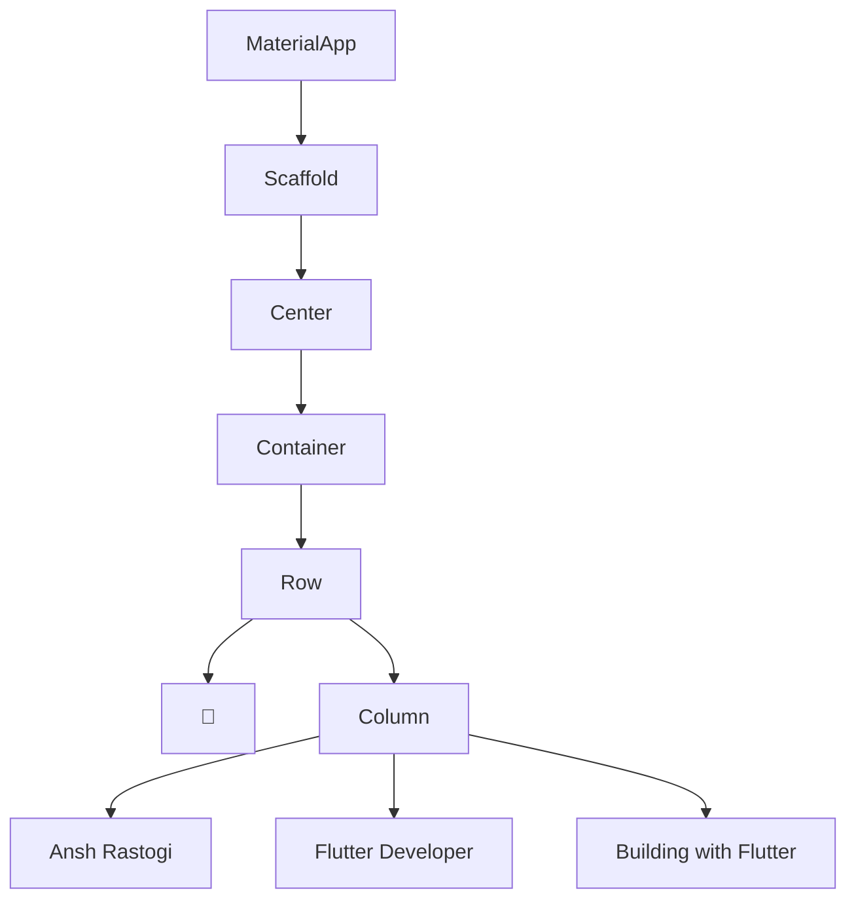
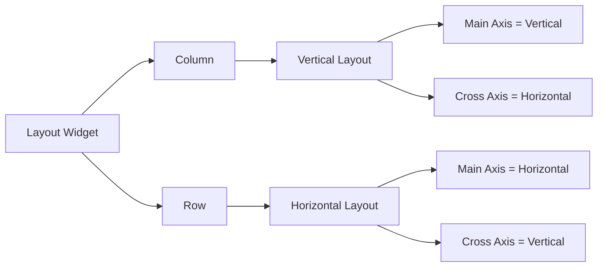
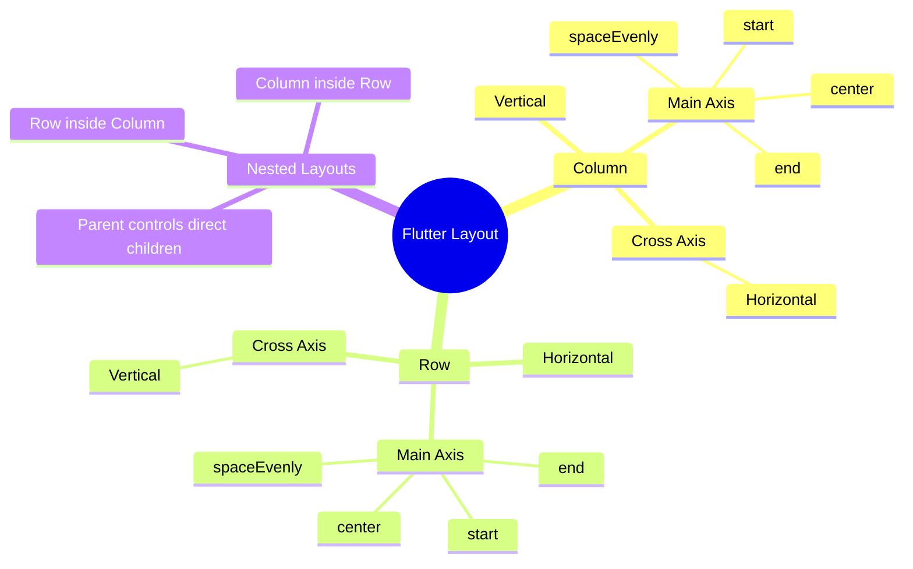

# 🚀 Flutter Journey — Day 05

> **"UI is not about placing widgets. UI is about understanding relationships between widgets."**

📅 **Date:** 12 August 2026  
📚 **Day:** 05  
🎯 **Focus:** Row, Column & Flutter Layout Thinking  
🧠 **Status:** ✅ Completed

---

# 🧭 Day 05 Overview

Today was the first day where Flutter UI started feeling like an actual
**layout system** instead of a collection of individual widgets.

Until Day 04, we mainly worked with individual widgets and basic spacing.

Today we learned how to combine multiple widgets and control their
position using:

- `Row`
- `Column`
- `children`
- `MainAxisAlignment`
- `CrossAxisAlignment`
- Nested `Row` + `Column`
- Widget hierarchy
- Available space
- Direct-child relationships

The main goal was not memorizing properties.

The goal was understanding:

> **Which widget controls which children?**

---

# 🎯 Learning Objectives

By the end of Day 05, I learned how to:

- Arrange widgets vertically using `Column`
- Arrange widgets horizontally using `Row`
- Use `children` to provide multiple widgets
- Understand `List<Widget>`
- Understand Main Axis
- Understand Cross Axis
- Use `MainAxisAlignment`
- Use `CrossAxisAlignment`
- Understand available space
- Nest `Row` and `Column`
- Think in terms of Widget Trees
- Predict UI output before running the application

---

# 📚 Topics Covered

## 1. Column

`Column` arranges its children vertically.

```dart
Column(
  children: [
    Text("A"),
    Text("B"),
    Text("C"),
  ],
)
```

Output:

```text
A
B
C
```

### Column Axis

```text
Main Axis  = Vertical
Cross Axis = Horizontal
```

---

# 2. Row

`Row` arranges its children horizontally.

```dart
Row(
  children: [
    Text("A"),
    Text("B"),
    Text("C"),
  ],
)
```

Output:

```text
A   B   C
```

### Row Axis

```text
Main Axis  = Horizontal
Cross Axis = Vertical
```

---

# 3. children

Unlike widgets such as `Center`, `Padding`, etc. which commonly use
a single `child`, `Row` and `Column` use:

```dart
children: []
```

because they are designed to contain multiple widgets.

Example:

```dart
Column(
  children: [
    Text("Ansh"),
    Text("Flutter"),
    Text("Developer"),
  ],
)
```

---

# 🧠 Dart Connection

The `children` property connects directly to the Dart concept of Lists.

Example:

```dart
List<String> names = [
  "Ansh",
  "Rahul",
  "Aman",
];
```

Similarly, Flutter can have:

```dart
children: [
  Text("Ansh"),
  Text("Rahul"),
  Text("Aman"),
]
```

Conceptually:

```text
children
   ↓
List of Widgets
```

---

# 4. Main Axis

The Main Axis is the primary direction in which a layout widget
arranges its children.

## Column

```text
       Main Axis
           ↓
           ↓
           ↓
```

Therefore:

```text
Column → Main Axis = Vertical
```

## Row

```text
Main Axis → → → → →
```

Therefore:

```text
Row → Main Axis = Horizontal
```

---

# 🧠 Golden Rule

```text
Column → ↓
Row    → →
```

Remembering this makes the alignment system much easier.

---

# 5. Cross Axis

The Cross Axis is perpendicular to the Main Axis.

## Column

```text
Main Axis  = Vertical
Cross Axis = Horizontal
```

## Row

```text
Main Axis  = Horizontal
Cross Axis = Vertical
```

---

# 📊 Axis Memory Chart

| Widget | Main Axis | Cross Axis |
|--------|-----------|------------|
| Column | Vertical ↓ | Horizontal ←→ |
| Row | Horizontal ←→ | Vertical ↑↓ |

---

# 6. MainAxisAlignment

`MainAxisAlignment` controls how a layout's direct children are
positioned along its Main Axis.

Common values:

```dart
MainAxisAlignment.start
MainAxisAlignment.center
MainAxisAlignment.end
MainAxisAlignment.spaceEvenly
```

---

## Column Example

```dart
Column(
  mainAxisAlignment: MainAxisAlignment.center,
  children: [
    Text("A"),
    Text("B"),
    Text("C"),
  ],
)
```

Since Column's Main Axis is vertical:

```text
MainAxisAlignment
        ↓
Vertical positioning
```

---

## Row Example

```dart
Row(
  mainAxisAlignment: MainAxisAlignment.center,
  children: [
    Text("A"),
    Text("B"),
    Text("C"),
  ],
)
```

Since Row's Main Axis is horizontal:

```text
MainAxisAlignment
        ↓
Horizontal positioning
```

---

# 7. CrossAxisAlignment

`CrossAxisAlignment` controls direct children along the Cross Axis.

For Column:

```text
Cross Axis = Horizontal
```

For Row:

```text
Cross Axis = Vertical
```

Example:

```dart
Column(
  crossAxisAlignment: CrossAxisAlignment.start,
  children: [
    Text("Ansh"),
    Text("Flutter Developer"),
  ],
)
```

The Text widgets are controlled horizontally.

---

# 8. Available Space

One of the most important concepts learned today:

> **Alignment needs available space.**

If a `Row` is only as large as its children:

```text
A B C
```

there may be no meaningful extra horizontal space for alignment to
visibly change anything.

If we give the Row a larger area:

```dart
Container(
  width: 250,
  height: 80,
  child: Row(
    mainAxisAlignment: MainAxisAlignment.spaceEvenly,
    children: [
      Text("A"),
      Text("B"),
      Text("C"),
    ],
  ),
)
```

there is now extra space.

Flutter can distribute that space.

---

# 🧠 Important Mental Model

```text
Available Space
       ↓
Alignment
       ↓
Children Position
```

Alignment does NOT magically move widgets.

It positions children **inside the space available to their parent**.

---

# 9. Nested Layouts

Today we learned that layouts can be nested.

Example:

```dart
Row(
  children: [
    Text("🚀"),

    Column(
      children: [
        Text("Ansh Rastogi"),
        Text("Flutter Developer"),
      ],
    ),
  ],
)
```

This creates:

```text
Row
│
├── 🚀
│
└── Column
    │
    ├── Ansh Rastogi
    └── Flutter Developer
```

---

# 🔥 Direct Children Concept

This was one of the most important concepts of Day 05.

Every layout widget controls its **direct children**.

Example:

```text
Row
│
├── 🚀
└── Column
    ├── Name
    └── Goal
```

The Row controls:

```text
🚀 + Column
```

The Column controls:

```text
Name + Goal
```

The Row does NOT directly control:

```text
Name
Goal
```

because those widgets belong directly to the Column.

---

# 🧠 Professional Rule

> **A widget's alignment properties control its direct children.**

This rule becomes extremely important when building complex Flutter UIs.

---

# 🌳 Widget Tree

Today's nested layout can be represented as:



---

# 🔄 Row vs Column



---

# 🧠 Alignment Mind Map



---

# 🏗️ Today's Final Layout

The final practice layout created today:

```text
┌─────────────────────────────────────┐
│                                     │
│          🚀  Ansh Rastogi           │
│              Flutter Developer      │
│              Building with Flutter  │
│                                     │
│                                     │
└─────────────────────────────────────┘
```

The structure:

```text
Container
│
└── Row
    │
    ├── 🚀
    │
    └── Column
        ├── Ansh Rastogi
        ├── Flutter Developer
        └── Building with Flutter
```

---

# 💻 Day 05 Practice Code

```dart
import 'package:flutter/material.dart';

void main() {
  runApp(const MyApp());
}

class MyApp extends StatelessWidget {
  const MyApp({super.key});

  @override
  Widget build(BuildContext context) {
    String name = "Ansh Rastogi";
    String goal = "Flutter Developer";

    return MaterialApp(
      debugShowCheckedModeBanner: false,

      home: Scaffold(
        backgroundColor: Colors.blueGrey.shade900,

        appBar: AppBar(
          backgroundColor: Colors.black87,
          title: const Text(
            "Row & Column Practice",
            style: TextStyle(
              color: Colors.cyanAccent,
            ),
          ),
        ),

        body: Center(
          child: Container(
            width: 320,
            height: 180,
            color: Colors.blueGrey.shade800,

            child: Row(
              mainAxisAlignment: MainAxisAlignment.center,
              crossAxisAlignment: CrossAxisAlignment.center,

              children: [
                const Text(
                  "🚀",
                  style: TextStyle(
                    fontSize: 40,
                  ),
                ),

                Column(
                  mainAxisAlignment: MainAxisAlignment.center,
                  crossAxisAlignment: CrossAxisAlignment.start,

                  children: [
                    Text(
                      name,
                      style: const TextStyle(
                        color: Colors.white,
                        fontSize: 20,
                      ),
                    ),

                    Text(
                      goal,
                      style: const TextStyle(
                        color: Colors.cyanAccent,
                        fontSize: 16,
                      ),
                    ),

                    const Text(
                      "Building with Flutter",
                      style: TextStyle(
                        color: Colors.white70,
                      ),
                    ),
                  ],
                ),

                const Text(
                  "🚀",
                  style: TextStyle(
                    fontSize: 40,
                  ),
                ),
              ],
            ),
          ),
        ),
      ),
    );
  }
}
```

---

# 🎨 UI Design Used Today

Today's practice used a dark developer-style theme.

### Background

```dart
Colors.blueGrey.shade900
```

### Container

```dart
Colors.blueGrey.shade800
```

### AppBar

```dart
Colors.black87
```

### Primary Text

```dart
Colors.white
```

### Accent

```dart
Colors.cyanAccent
```

### Secondary Text

```dart
Colors.white70
```

---

# 💼 Real-World Usage

## Column is commonly used for:

- Login forms
- Profile information
- Settings screens
- Vertical menus
- Dashboard sections
- Text groups
- Forms

## Row is commonly used for:

- Profile + information
- Icon + text
- Buttons side-by-side
- Navigation bars
- Social links
- Card headers
- Statistics

## Nested Row + Column

This combination is extremely common.

Example:

```text
Profile Card

Row
├── Profile Image
└── Column
    ├── Name
    ├── Role
    └── Description
```

---

# ⚠️ Common Mistakes

### ❌ Mistake 1

Thinking Row's Main Axis is vertical.

Correct:

```text
Row → Horizontal
```

---

### ❌ Mistake 2

Thinking Column's Main Axis is horizontal.

Correct:

```text
Column → Vertical
```

---

### ❌ Mistake 3

Thinking `crossAxisAlignment` controls the entire screen.

It only controls the layout widget's direct children.

---

### ❌ Mistake 4

Expecting alignment to work visibly when there is no extra space.

Remember:

```text
No Extra Space
      ↓
Little/No Visible Alignment Effect
```

---

### ❌ Mistake 5

Thinking a parent's alignment controls deeply nested widgets.

Example:

```text
Row
└── Column
    └── Text
```

Row controls Column.

Column controls Text.

---

# 🧠 Quick Revision

```text
Column
↓
Vertical

Row
→
Horizontal
```

```text
Column:
Main Axis  = Vertical
Cross Axis = Horizontal
```

```text
Row:
Main Axis  = Horizontal
Cross Axis = Vertical
```

```text
MainAxisAlignment
        ↓
Main Axis

CrossAxisAlignment
        ↓
Cross Axis
```

---

# 🧪 Prediction Questions

## Easy

### Q1

What is the Main Axis of Column?

### Q2

What is the Main Axis of Row?

---

## Medium

### Q3

Who controls the following widgets?

```text
Row
├── Icon
└── Column
    ├── Text
    └── Text
```

Does Row directly control the two Text widgets?

---

## Challenge 🔥

Predict the output:

```dart
Column(
  mainAxisAlignment: MainAxisAlignment.end,
  crossAxisAlignment: CrossAxisAlignment.start,
  children: [
    Text("A"),
    Text("B"),
    Text("C"),
  ],
)
```

Explain:

- Vertical position
- Horizontal position
- Why

---

# 🏆 Today's Achievement

Today I moved from:

```text
Single Widget
```

to:

```text
Multiple Widgets
```

and then to:

```text
Nested Widget Layouts
```

I can now reason about:

```text
Parent
  ↓
Direct Children
  ↓
Axis
  ↓
Alignment
  ↓
Available Space
```

---

# 💼 AnshVerse Progress

## Before Day 05

AnshVerse was based around a simple Counter App.

## Day 05 Direction

The long-term Portfolio App is now moving toward a professional
developer profile layout.

Planned structure:

```text
AnshVerse
│
└── Home
    │
    └── Hero Section
        │
        ├── Profile
        │
        └── Developer Information
            ├── Name
            ├── Role
            └── Description
```

Today's `Row + Column` knowledge will later be used for the Hero Section.

---

# 📈 Flutter Journey Progress

| Day | Topic | Status |
|-----|-------|--------|
| Day 01 | Flutter Basics + runApp | ✅ |
| Day 02 | StatelessWidget + build | ✅ |
| Day 03 | Container + Alignment | ✅ |
| Day 04 | Padding + Margin + EdgeInsets | ✅ |
| **Day 05** | **Row + Column + Alignment** | **✅** |

---

# 🧠 Developer Mindset

Today's biggest lesson:

> **Don't think of Flutter UI as a picture. Think of it as a hierarchy of relationships.**

Instead of asking:

> "Where do I put this Text?"

Think:

> "Which parent should own this Text?"

Then:

> "How should that parent arrange its direct children?"

This mindset scales from simple apps to complex production interfaces.

---

# 🚀 Day 05 Status

```text
━━━━━━━━━━━━━━━━━━━━━━━━━━━━━━

Flutter Day 05

Row                    ✅
Column                 ✅
children               ✅
Main Axis              ✅
Cross Axis             ✅
MainAxisAlignment      ✅
CrossAxisAlignment     ✅
Available Space        ✅
Nested Layouts         ✅
Widget Tree Thinking   ✅

STATUS: COMPLETED 🚀

━━━━━━━━━━━━━━━━━━━━━━━━━━━━━━
```

---

# 🔮 Next Mission — Day 06

Next we will continue building our UI foundation.

Planned concepts:

- Controlled spacing
- `SizedBox`
- Better spacing between widgets
- Improving Row + Column layouts
- Making today's UI cleaner
- Applying the concepts to **AnshVerse**

The goal:

```text
Functional UI
      ↓
Organized UI
      ↓
Clean UI
      ↓
Professional UI
```

---

> **Day 05 complete.**
>
> **Today I didn't just learn Row and Column.
> I learned how Flutter widgets communicate through hierarchy and layout.** 🚀