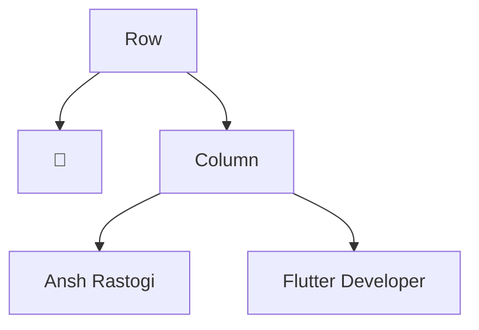
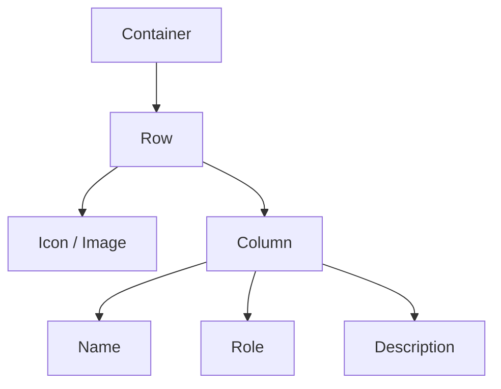
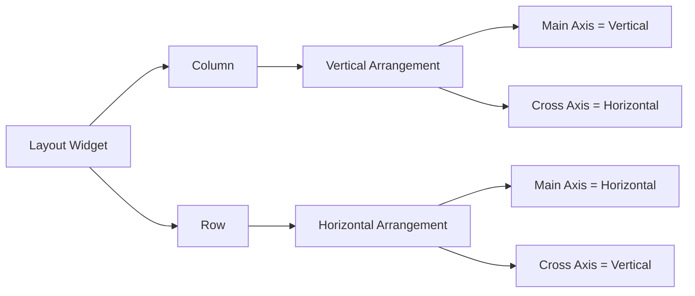
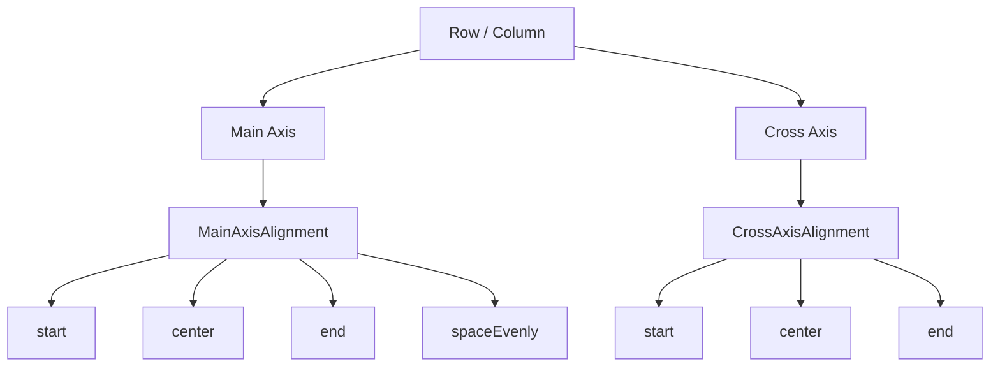
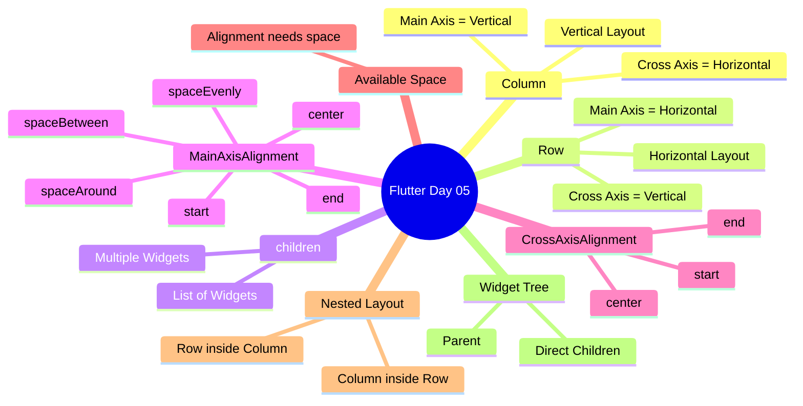

# 🚀 Flutter Journey — Day 05 Notes

> **Core Idea:** `Column` = Vertical Layout | `Row` = Horizontal Layout

📅 **Day:** 05  
🎯 **Topic:** Row, Column & Layout Thinking  
✅ **Status:** Completed

---

# 📌 What We Learned Today

Today we learned how Flutter arranges multiple widgets using:

- `Column`
- `Row`
- `children`
- `MainAxisAlignment`
- `CrossAxisAlignment`
- Main Axis
- Cross Axis
- Available Space
- Nested Row + Column
- Direct Children
- Widget Tree

---

# 1️⃣ Column

## What is Column?

`Column` is a Flutter layout widget used to arrange multiple widgets **vertically**.

### Example

```dart
Column(
  children: [
    Text("Ansh"),
    Text("Flutter"),
    Text("Developer"),
  ],
)
```

### Output

```text
Ansh
Flutter
Developer
```

### Easy Memory

> 📚 **Column = widgets one below another**

```text
A
↓
B
↓
C
```

---

# 2️⃣ Row

## What is Row?

`Row` is a Flutter layout widget used to arrange multiple widgets **horizontally**.

### Example

```dart
Row(
  children: [
    Text("Ansh"),
    Text("Flutter"),
    Text("Developer"),
  ],
)
```

### Output

```text
Ansh   Flutter   Developer
```

### Easy Memory

> ➡️ **Row = widgets side-by-side**

```text
A → B → C
```

---

# 3️⃣ Row vs Column

| Widget | Arrangement | Main Axis | Cross Axis |
|---|---|---|---|
| `Column` | Vertical ↓ | Vertical | Horizontal |
| `Row` | Horizontal → | Horizontal | Vertical |

### Memory Trick

```text
Column → ↓

Row → →
```

---

# 4️⃣ Main Axis

The **Main Axis** is the direction in which a Row or Column naturally arranges its children.

## Column

```text
      Main Axis
          ↓
          ↓
          ↓
          A
          B
          C
```

Therefore:

```text
Column
Main Axis = Vertical
```

---

## Row

```text
Main Axis → → → → →

A     B     C
```

Therefore:

```text
Row
Main Axis = Horizontal
```

---

# 5️⃣ Cross Axis

The Cross Axis is the direction perpendicular to the Main Axis.

## Column

```text
Main Axis
    ↓
    ↓
    ↓

←────────────→
  Cross Axis
```

Therefore:

```text
Column
Main Axis  = Vertical
Cross Axis = Horizontal
```

---

## Row

```text
Cross Axis
    ↑
    │
    │
A → B → C
    │
    ↓
```

Therefore:

```text
Row
Main Axis  = Horizontal
Cross Axis = Vertical
```

---

# 🧠 Golden Axis Rule

```text
Column → Main Axis = Vertical
Row    → Main Axis = Horizontal
```

Then:

```text
MainAxisAlignment
        ↓
Controls Main Axis

CrossAxisAlignment
        ↓
Controls Cross Axis
```

---

# 6️⃣ children

`Row` and `Column` can contain multiple widgets.

That's why they use:

```dart
children: []
```

Example:

```dart
Column(
  children: [
    Text("A"),
    Text("B"),
    Text("C"),
  ],
)
```

---

# 🧠 Dart Connection

`children` is conceptually a list of widgets.

Dart List:

```dart
List<String> names = [
  "Ansh",
  "Rahul",
  "Aman",
];
```

Flutter:

```dart
children: [
  Text("Ansh"),
  Text("Rahul"),
  Text("Aman"),
]
```

Think:

```text
children
    ↓
List of Widgets
```

---

# 7️⃣ MainAxisAlignment

`MainAxisAlignment` controls how the direct children are positioned along the **Main Axis**.

Common values:

```dart
MainAxisAlignment.start
MainAxisAlignment.center
MainAxisAlignment.end
MainAxisAlignment.spaceEvenly
MainAxisAlignment.spaceAround
MainAxisAlignment.spaceBetween
```

---

## `start`

Children are placed at the beginning of the Main Axis.

---

## `center`

Children are placed in the center of the available Main Axis space.

Example:

```dart
Column(
  mainAxisAlignment: MainAxisAlignment.center,
  children: [
    Text("A"),
    Text("B"),
    Text("C"),
  ],
)
```

---

## `end`

Children are placed at the end of the Main Axis.

---

## `spaceEvenly`

Available space is distributed evenly around the children.

```text
┌──────────────────────────────┐
│                              │
│    A          B          C   │
│                              │
└──────────────────────────────┘
```

---

# 8️⃣ CrossAxisAlignment

`CrossAxisAlignment` controls the direct children along the **Cross Axis**.

Example:

```dart
Column(
  crossAxisAlignment: CrossAxisAlignment.start,
  children: [
    Text("Ansh"),
    Text("Flutter Developer"),
  ],
)
```

Because Column's Cross Axis is horizontal, this affects horizontal positioning.

---

# 9️⃣ Alignment Needs Available Space

This is one of the most important concepts from Day 05.

Alignment needs **available space** to show a visible effect.

Suppose:

```dart
Row(
  children: [
    Text("A"),
    Text("B"),
    Text("C"),
  ],
)
```

If the Row is only as wide as its children, there is very little extra space.

Therefore changing:

```dart
MainAxisAlignment.start
MainAxisAlignment.center
MainAxisAlignment.end
```

may not produce an obvious difference.

---

## Give the Row extra space

```dart
Container(
  width: 300,
  height: 100,
  child: Row(
    mainAxisAlignment: MainAxisAlignment.spaceEvenly,
    children: [
      Text("A"),
      Text("B"),
      Text("C"),
    ],
  ),
)
```

Now Flutter has extra horizontal space to distribute.

### Mental Model

```text
Available Space
       ↓
Alignment
       ↓
Children Position
```

### Golden Rule

> Alignment does not magically move widgets.  
> It positions children inside the space available to their parent.

---

# 🔟 Nested Row + Column

Real Flutter UI often requires layouts inside layouts.

Example:

```dart
Row(
  children: [
    Text("🚀"),

    Column(
      children: [
        Text("Ansh Rastogi"),
        Text("Flutter Developer"),
      ],
    ),
  ],
)
```

Output:

```text
🚀   Ansh Rastogi
     Flutter Developer
```

---

# 🌳 Widget Tree



---

# 1️⃣1️⃣ Direct Children Rule

This is a very important Flutter concept.

> **A widget's alignment properties control its direct children.**

Example:

```text
Row
│
├── 🚀
│
└── Column
    │
    ├── Name
    └── Goal
```

The Row directly controls:

```text
🚀
Column
```

The Column directly controls:

```text
Name
Goal
```

The Row does **not** directly control:

```text
Name
Goal
```

because they belong to the Column.

---

# 🧠 Example

If we write:

```dart
Row(
  crossAxisAlignment: CrossAxisAlignment.center,

  children: [
    Text("🚀"),

    Column(
      crossAxisAlignment: CrossAxisAlignment.start,

      children: [
        Text("Ansh Rastogi"),
        Text("Flutter Developer"),
      ],
    ),
  ],
)
```

Then:

### Row's alignment

Controls:

```text
🚀 + Column
```

### Column's alignment

Controls:

```text
Name + Goal
```

---

# 1️⃣2️⃣ Nested Layout Thinking

Whenever we see a UI, break it into a Widget Tree.

Example:

```text
🚀   Ansh Rastogi
     Flutter Developer
     Building with Flutter
```

Think:

```text
Row
├── 🚀
└── Column
    ├── Name
    ├── Goal
    └── Description
```

This is much better than thinking:

> "Where should I put this Text?"

Instead think:

> "Which parent should own this Text?"

---

# 🏗️ Layout Thinking

Professional Flutter development is largely about understanding:

```text
Parent
   ↓
Direct Children
   ↓
Layout Direction
   ↓
Available Space
   ↓
Alignment
```

---

# 🧩 Row + Column Combination

A very common real-world pattern:

```text
Row
├── Profile Image
└── Column
    ├── Name
    ├── Role
    └── Description
```

This pattern is used in:

- Profile cards
- User lists
- Chat applications
- Product cards
- Dashboard cards
- Settings screens
- Social media UI

---

# 📐 Widget Tree Example



---

# 🔄 Row vs Column Diagram



---

# 🧠 Alignment Diagram



---

# 🧠 Day 05 Mind Map



---

# 🎨 Day 05 Practice UI

Today's UI followed a dark developer theme.

```text
Background
    ↓
blueGrey.shade900

Card
    ↓
blueGrey.shade800

AppBar
    ↓
black87

Primary Text
    ↓
white

Accent
    ↓
cyanAccent

Secondary Text
    ↓
white70
```

---

# 💻 Today's Practice Code

```dart
import 'package:flutter/material.dart';

void main() {
  runApp(const MyApp());
}

class MyApp extends StatelessWidget {
  const MyApp({super.key});

  @override
  Widget build(BuildContext context) {
    String name = "Ansh Rastogi";
    String goal = "Flutter Developer";

    return MaterialApp(
      debugShowCheckedModeBanner: false,

      home: Scaffold(
        backgroundColor: Colors.blueGrey.shade900,

        appBar: AppBar(
          backgroundColor: Colors.black87,
          title: const Text(
            "Row & Column Practice",
            style: TextStyle(
              color: Colors.cyanAccent,
            ),
          ),
        ),

        body: Center(
          child: Container(
            width: 320,
            height: 180,
            color: Colors.blueGrey.shade800,

            child: Row(
              mainAxisAlignment: MainAxisAlignment.center,
              crossAxisAlignment: CrossAxisAlignment.center,

              children: [
                const Text(
                  "🚀",
                  style: TextStyle(
                    fontSize: 40,
                  ),
                ),

                Column(
                  mainAxisAlignment: MainAxisAlignment.center,
                  crossAxisAlignment: CrossAxisAlignment.start,

                  children: [
                    Text(
                      name,
                      style: const TextStyle(
                        color: Colors.white,
                        fontSize: 20,
                      ),
                    ),

                    Text(
                      goal,
                      style: const TextStyle(
                        color: Colors.cyanAccent,
                        fontSize: 16,
                      ),
                    ),

                    const Text(
                      "Building with Flutter",
                      style: TextStyle(
                        color: Colors.white70,
                      ),
                    ),
                  ],
                ),

                const Text(
                  "🚀",
                  style: TextStyle(
                    fontSize: 40,
                  ),
                ),
              ],
            ),
          ),
        ),
      ),
    );
  }
}
```

---

# ⚠️ Common Mistakes

## ❌ 1. Confusing Row and Column

Wrong:

```text
Row → Vertical
```

Correct:

```text
Row → Horizontal
```

---

## ❌ 2. Confusing Main Axis

Remember:

```text
Column → Main Axis = Vertical

Row → Main Axis = Horizontal
```

---

## ❌ 3. Thinking CrossAxisAlignment controls the screen

It controls the direct children of the Row/Column.

---

## ❌ 4. Expecting alignment without available space

If there is no extra space, alignment may appear to do nothing.

---

## ❌ 5. Thinking parent controls all nested widgets

Example:

```text
Row
└── Column
    └── Text
```

Row controls Column.

Column controls Text.

---

# 💼 Real-World Usage

## Column

Commonly used for:

- Login forms
- Profile information
- Settings
- Vertical menus
- Forms
- Dashboard sections

## Row

Commonly used for:

- Icon + Text
- Profile + Information
- Buttons
- Navigation
- Social links
- Card headers
- Statistics

## Nested Row + Column

Very common for:

```text
Profile Image
     +
User Information
```

```text
Row
├── Image
└── Column
    ├── Name
    ├── Role
    └── Description
```

---

# 🧪 Practice Questions

## Easy

### Q1

What is the Main Axis of a Column?

### Q2

What is the Main Axis of a Row?

---

## Medium

Given:

```text
Row
├── Icon
└── Column
    ├── Name
    └── Role
```

Which widget controls the Icon and Column?

Which widget controls Name and Role?

---

## 🔥 Challenge

Predict the result:

```dart
Column(
  mainAxisAlignment: MainAxisAlignment.end,
  crossAxisAlignment: CrossAxisAlignment.start,

  children: [
    Text("A"),
    Text("B"),
    Text("C"),
  ],
)
```

Explain:

1. Where will the children move vertically?
2. Where will they be aligned horizontally?
3. Why?

---

# 🎯 Quick Revision

```text
Column = ↓
Row    = →
```

```text
Column:
Main Axis  = Vertical
Cross Axis = Horizontal
```

```text
Row:
Main Axis  = Horizontal
Cross Axis = Vertical
```

```text
MainAxisAlignment
        ↓
Main Axis

CrossAxisAlignment
        ↓
Cross Axis
```

```text
Alignment
    ↓
Needs Available Space
```

```text
Parent
  ↓
Direct Children
  ↓
Alignment
```

---

# 🧠 One-Minute Memory Formula

```text
COLUMN
  ↓
Vertical
  ↓
Main Axis = Vertical
  ↓
MainAxisAlignment = Up/Down
  ↓
CrossAxisAlignment = Left/Right
```

```text
ROW
  →
Horizontal
  →
Main Axis = Horizontal
  →
MainAxisAlignment = Left/Right
  →
CrossAxisAlignment = Up/Down
```

---

# 🚀 AnshVerse Application

Today's Row + Column knowledge will be used in the future AnshVerse Hero Section.

Planned structure:

```text
AnshVerse
    │
    └── Hero Section
        │
        └── Row
            ├── Profile Image
            └── Column
                ├── Name
                ├── Role
                └── Description
```

The current Day 05 practice UI is therefore not just practice.

It is the first layout pattern that will later become part of the real Portfolio App.

---

# 🏆 Day 05 Achievement

Today I learned how to think about Flutter UI as a **Widget Tree**.

I can now reason about:

```text
Parent
   ↓
Direct Children
   ↓
Row / Column
   ↓
Main Axis
   ↓
Cross Axis
   ↓
Available Space
   ↓
Alignment
```

---

# 🔮 Next Day Preview

## Flutter Day 06

We will continue improving UI layouts and learn how to control spacing between widgets more precisely.

Focus will move from:

```text
"How do I arrange widgets?"
```

to:

```text
"How do I create clean and intentional spacing?"
```

---

# 🚀 Status

```text
Flutter Day 05
━━━━━━━━━━━━━━━━━━━━━━━━━━

Column                  ✅
Row                     ✅
children                ✅
Main Axis               ✅
Cross Axis              ✅
MainAxisAlignment       ✅
CrossAxisAlignment      ✅
Available Space         ✅
Nested Layouts          ✅
Widget Tree Thinking    ✅

STATUS: COMPLETED 🚀
```

> **"Don't memorize the layout. Understand the relationship between the widgets."**