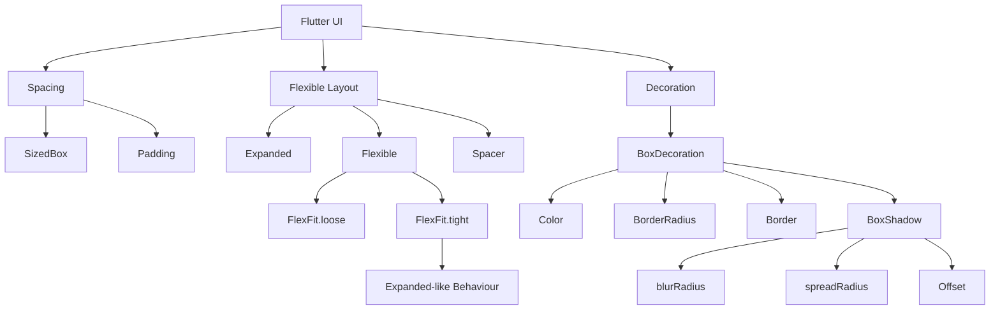
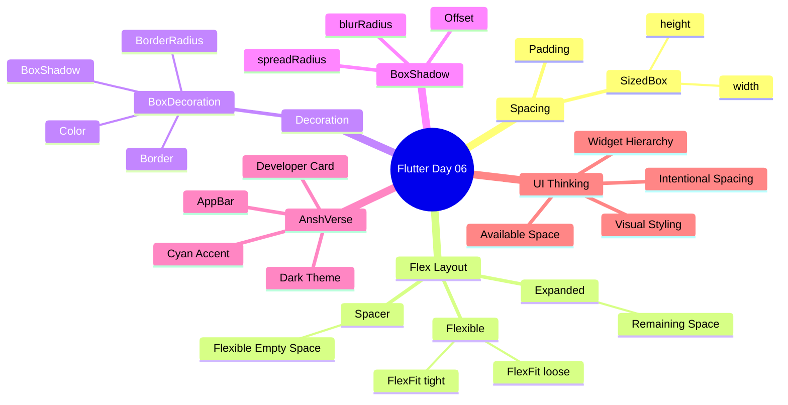

# 🚀 Flutter Journey — Day 06

> **From basic layouts to flexible, decorated and developer-style UI.** 🔥

📅 **Day:** 06  
🎯 **Focus:** Flexible Layouts, Spacing & Container Decoration  
📱 **Project:** Daily Learning App  
🎨 **Practice UI:** AnshVerse Developer Card  
✅ **Status:** Completed

---

# 📚 What I Learned Today

Today I learned how Flutter handles **available space** inside `Row` and `Column`, how to create intentional spacing, and how to turn a simple `Container` into a visually attractive UI card.

### Topics Covered

- 📏 `SizedBox`
- 📦 `Padding`
- 🧩 `Expanded`
- 🟢 `Flexible`
- 🔗 `FlexFit.tight`
- 🔗 `FlexFit.loose`
- ↔️ `Spacer`
- 🎨 `BoxDecoration`
- 🔲 `BorderRadius`
- 🖼️ `Border`
- 🌑 `BoxShadow`
- 🌫️ `blurRadius`
- 📡 `spreadRadius`
- 🧭 `Offset`
- 🧠 Available Space
- 🎨 UI Composition

---

# 📏 1. SizedBox

`SizedBox` is mainly used to create **fixed spacing** between widgets.

## Vertical Spacing

Inside a `Column`:

```dart
const SizedBox(
  height: 8,
)
```

This creates vertical space.

### Easy Rule

```text
Column
   ↓
Vertical Layout
   ↓
SizedBox(height: ...)
```

---

## Horizontal Spacing

Inside a `Row`:

```dart
const SizedBox(
  width: 20,
)
```

This creates horizontal space.

### Easy Rule

```text
Row
   ↓
Horizontal Layout
   ↓
SizedBox(width: ...)
```

---

# 📦 2. Padding

`Padding` creates space around its child.

Example:

```dart
Padding(
  padding: const EdgeInsets.all(20),
  child: Text("Hello Ansh"),
)
```

Mental Model:

```text
┌─────────────────────────┐
│                         │
│       Padding           │
│    ┌─────────────┐      │
│    │    Child    │      │
│    └─────────────┘      │
│                         │
└─────────────────────────┘
```

Padding controls the space between the **child and its surrounding boundary**.

---

# 🧩 3. Expanded

`Expanded` is used inside:

- `Row`
- `Column`
- Flex-based layouts

It tells Flutter:

> Take the remaining available space.

Example:

```dart
Row(
  children: [
    const Text("🚀"),

    Expanded(
      child: Text("Ansh Rastogi"),
    ),

    const Text("🎯"),
  ],
)
```

Concept:

```text
Available Width

┌──────────────────────────────────┐
│ 🚀 │       EXPANDED       │ 🎯 │
└──────────────────────────────────┘
          ↑
   Takes remaining space
```

---

# ⚠️ Important Expanded Rule

`Expanded` should normally be a direct child of a Flex widget.

Correct:

```text
Row
 └── Expanded ✅
```

Correct:

```text
Column
 └── Expanded ✅
```

Incorrect structure:

```text
Container
 └── Expanded ❌
```

---

# 🟢 4. Flexible

`Flexible` also works with available space.

But unlike `Expanded`, it can allow its child to use space more flexibly depending on its `fit`.

Example:

```dart
Flexible(
  child: Column(
    children: [
      Text("Ansh Rastogi"),
      Text("Flutter Developer"),
    ],
  ),
)
```

---

# 🔗 5. FlexFit.loose

By default, `Flexible` uses:

```dart
FlexFit.loose
```

Example:

```dart
Flexible(
  fit: FlexFit.loose,
  child: Text("Flutter Developer"),
)
```

Meaning:

> Space available hai, but child ko poori space occupy karna compulsory nahi hai.

Mental Model:

```text
Available Space
──────────────────────────────

Child
──────

Remaining space can stay unused.
```

---

# 🔥 6. FlexFit.tight

Example:

```dart
Flexible(
  fit: FlexFit.tight,
  child: Text("Flutter Developer"),
)
```

Now Flutter tells the child:

> Available flex space ko fill karo.

This behaves similarly to `Expanded`.

---

# 🧠 Expanded vs Flexible

Important connection learned today:

```dart
Expanded(
  child: MyWidget(),
)
```

Conceptually behaves like:

```dart
Flexible(
  fit: FlexFit.tight,
  child: MyWidget(),
)
```

Mental Model:

```text
Flexible
│
├── FlexFit.loose
│      ↓
│   Flexible size
│
└── FlexFit.tight
       ↓
   Fill flex space
       ↓
   Expanded-like behaviour
```

---

# ↔️ 7. Spacer

`Spacer` creates flexible empty space between widgets.

Example from today's AppBar:

```dart
Row(
  children: [
    Text("AnshVerse"),

    Spacer(),

    Text("🎭"),
  ],
)
```

Result:

```text
AnshVerse                         🎭
           <---- SPACE ---->
```

This is extremely useful in:

- AppBars
- Headers
- Navigation Bars
- Toolbars
- Cards

---

# 🧠 Spacer Mental Model

```text
Row
│
├── Widget A
│
├── Spacer
│      ↓
│   Remaining Space
│
└── Widget B
```

Instead of manually guessing:

```dart
SizedBox(width: 200)
```

we can sometimes allow Flutter to manage the remaining space using:

```dart
Spacer()
```

---

# 🎨 8. BoxDecoration

Previously I used:

```dart
Container(
  color: Colors.blueGrey,
)
```

But for advanced styling I learned:

```dart
Container(
  decoration: BoxDecoration(
    color: Colors.blueGrey,
  ),
)
```

`BoxDecoration` allows multiple visual properties.

Examples:

```text
BoxDecoration
│
├── color
├── border
├── borderRadius
├── boxShadow
├── gradient
└── image
```

Today I practiced:

- color
- border
- borderRadius
- boxShadow

---

# 🔲 9. BorderRadius

`BorderRadius` makes container corners rounded.

Example:

```dart
borderRadius: BorderRadius.circular(25),
```

Before:

```text
┌───────────────────────┐
│                       │
│       Container       │
│                       │
└───────────────────────┘
```

After:

```text
╭───────────────────────╮
│                       │
│       Container       │
│                       │
╰───────────────────────╯
```

---

# 🖼️ 10. Border

A border can be added using:

```dart
border: Border.all(
  color: Colors.cyanAccent,
  width: 1,
),
```

Meaning:

```text
Border.all()
│
├── color → Border Color
│
└── width → Border Thickness
```

For today's AnshVerse UI:

```dart
border: Border.all(
  color: Colors.cyanAccent,
  width: 1,
),
```

gave the developer card a cyan outline.

---

# 🌑 11. BoxShadow

`BoxShadow` adds shadow/glow around a container.

Example:

```dart
boxShadow: [
  BoxShadow(
    color: Colors.cyanAccent,
    blurRadius: 15,
    spreadRadius: 5,
    offset: Offset(0, 4),
  ),
],
```

---

# 🌫️ blurRadius

```dart
blurRadius: 15
```

Controls how blurred/soft the shadow looks.

Simple idea:

```text
Low Blur
████████

High Blur
░▒▓████▓▒░
```

Higher blur generally creates a softer shadow.

---

# 📡 spreadRadius

```dart
spreadRadius: 5
```

Controls how far the shadow spreads outward.

```text
Container
    ↓

┌─────────────┐
│             │
└─────────────┘

Spread
    ↓

░░░░░░░░░░░░░░░
░ ┌───────────┐ ░
░ │ Container │ ░
░ └───────────┘ ░
░░░░░░░░░░░░░░░
```

---

# 🧭 Offset

Example:

```dart
offset: Offset(0, 4)
```

Format:

```text
Offset(x, y)
```

Easy understanding:

```text
X → Horizontal direction
Y → Vertical direction
```

So:

```dart
Offset(0, 4)
```

means the shadow is shifted downward.

---

# 🎨 Today's Color Palette

I used a dark developer-style theme for the AnshVerse practice UI.

## Screen Background

```dart
const Color.fromARGB(255, 23, 46, 57)
```

## Developer Card

```dart
const Color.fromARGB(255, 30, 60, 74)
```

## AppBar

```dart
Colors.black87
```

## Accent Color

```dart
Colors.cyanAccent
```

## Main Text

```dart
Colors.white
```

## Secondary Text

```dart
Colors.white70
```

---

# 🚀 AnshVerse AppBar Practice

Today I also improved the AppBar.

```dart
appBar: AppBar(
  toolbarHeight: 80,
  backgroundColor: Colors.black87,
  title: Row(
    children: [
      Text(
        "AnshVerse",
        style: TextStyle(
          color: Colors.cyanAccent,
          fontSize: 24,
        ),
      ),

      Spacer(),

      Text(
        "🎭",
        style: TextStyle(
          fontSize: 24,
        ),
      ),
    ],
  ),
),
```

The `Spacer()` automatically pushes both widgets apart.

Visual:

```text
┌───────────────────────────────────────────┐
│                                           │
│ AnshVerse                              🎭 │
│                                           │
└───────────────────────────────────────────┘
```

---

# 💻 Final Developer Card Structure

```dart
Container(
  width: 320,
  height: 180,

  decoration: BoxDecoration(
    color: const Color.fromARGB(255, 30, 60, 74),

    borderRadius: BorderRadius.circular(25),

    border: Border.all(
      color: Colors.cyanAccent,
      width: 1,
    ),

    boxShadow: [
      BoxShadow(
        color: Colors.cyanAccent,
        blurRadius: 15,
        spreadRadius: 5,
        offset: Offset(0, 4),
      ),
    ],
  ),

  child: Row(
    mainAxisAlignment: MainAxisAlignment.center,
    crossAxisAlignment: CrossAxisAlignment.center,

    children: [
      const Text(
        "🚀",
        style: TextStyle(fontSize: 40),
      ),

      const SizedBox(width: 20),

      Flexible(
        fit: FlexFit.tight,

        child: Column(
          mainAxisAlignment: MainAxisAlignment.center,
          crossAxisAlignment: CrossAxisAlignment.center,

          children: [
            Text(
              name,
              style: const TextStyle(
                color: Colors.white,
                fontSize: 20,
              ),
            ),

            const SizedBox(height: 8),

            Text(
              goal,
              style: const TextStyle(
                color: Colors.cyanAccent,
                fontSize: 16,
              ),
            ),

            const SizedBox(height: 5),

            const Text(
              "Building with Flutter",
              style: TextStyle(
                color: Colors.white70,
              ),
            ),
          ],
        ),
      ),

      const SizedBox(width: 20),

      const Text(
        "🎯",
        style: TextStyle(fontSize: 40),
      ),
    ],
  ),
)
```

---

# 🌳 Today's Widget Tree

```text
MaterialApp
│
└── Scaffold
     │
     ├── AppBar
     │    │
     │    └── Row
     │         ├── AnshVerse
     │         ├── Spacer
     │         └── 🎭
     │
     └── Body
          │
          └── Center
               │
               └── Container
                    │
                    ├── BoxDecoration
                    │    ├── Color
                    │    ├── BorderRadius
                    │    ├── Border
                    │    └── BoxShadow
                    │
                    └── Row
                         │
                         ├── 🚀
                         │
                         ├── SizedBox
                         │
                         ├── Flexible
                         │    │
                         │    └── Column
                         │         ├── Name
                         │         ├── SizedBox
                         │         ├── Goal
                         │         ├── SizedBox
                         │         └── Description
                         │
                         ├── SizedBox
                         │
                         └── 🎯
```

---

# 🧠 Day 06 Concept Flow



---

# 🧠 Day 06 Mindmap



---

# 🔥 Biggest Observation Today

Today I started understanding that Flutter UI is not just:

```text
Widget
Widget
Widget
Widget
```

Instead, I should think like:

```text
Parent
   ↓
Available Space
   ↓
Layout Direction
   ↓
Children
   ↓
Space Distribution
   ↓
Spacing
   ↓
Decoration
```

This makes complex Flutter layouts easier to understand.

---

# 🧠 Quick Revision

| Widget / Property | Purpose |
|---|---|
| `SizedBox` | Fixed spacing |
| `Padding` | Space around child |
| `Expanded` | Takes remaining flex space |
| `Flexible` | Flexible use of available space |
| `FlexFit.loose` | Child doesn't have to fill flex space |
| `FlexFit.tight` | Child fills flex space |
| `Spacer` | Flexible empty space |
| `BoxDecoration` | Advanced box styling |
| `BorderRadius` | Rounded corners |
| `Border.all()` | Border around container |
| `BoxShadow` | Shadow/glow |
| `blurRadius` | Shadow softness |
| `spreadRadius` | Shadow spread |
| `Offset` | Shadow direction |

---

# 🧪 Experiments Performed

Today I did not just write the code.

I experimented with the properties and observed their behaviour.

### Experiments

- Removed and added `Padding`
- Tested `Expanded`
- Tested `Flexible`
- Compared `FlexFit.loose`
- Compared `FlexFit.tight`
- Observed that `tight` behaves like `Expanded`
- Used `Spacer` inside AppBar
- Added rounded corners
- Added cyan border
- Added shadow
- Changed `blurRadius`
- Changed `spreadRadius`
- Observed `Offset`
- Combined `Row + Flexible + Column`
- Improved the AnshVerse developer card

---

# 🏆 Day 06 Achievement

Today I moved from:

```text
"I know Row and Column."
```

to:

```text
"I understand how widgets share space."
```

and then to:

```text
"I can style that layout into an actual UI."
```

🔥 This was an important step toward real Flutter UI development.

---

# 📊 Day 06 Progress

| Concept | Status |
|---|---|
| SizedBox | ✅ |
| Padding Revision | ✅ |
| Expanded | ✅ |
| Flexible | ✅ |
| FlexFit.loose | ✅ |
| FlexFit.tight | ✅ |
| Spacer | ✅ |
| BoxDecoration | ✅ |
| BorderRadius | ✅ |
| Border | ✅ |
| BoxShadow | ✅ |
| blurRadius | ✅ |
| spreadRadius | ✅ |
| Offset | ✅ |
| Developer Card UI | ✅ |
| AnshVerse Practice | ✅ |

### 🚀 DAY 06 — COMPLETED

---

# 🔮 Day 07 Preview

Next step:

### 🎨 Better UI Components

The goal will be to continue moving from:

```text
Basic Flutter Layout
        ↓
Styled Layout
        ↓
Clean UI Components
        ↓
Reusable Components
        ↓
Real Application UI
```

AnshVerse will continue evolving alongside the Daily Learning App. 🚀

---

## 💡 Day 06 Final Lesson

> **Good Flutter UI is not created by randomly placing widgets.**
>
> **It is created by understanding hierarchy, available space, spacing and decoration.** 🚀🔥

---

### #Flutter #Dart #FlutterDevelopment #UIDesign #100DaysOfCode #AnshVerse 🚀