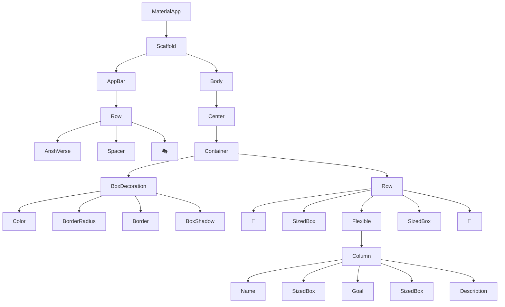
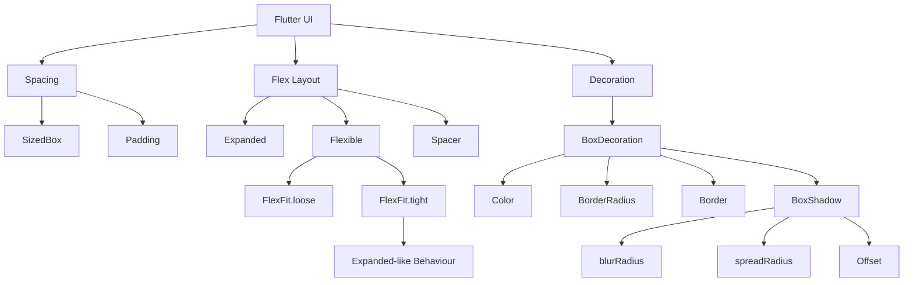
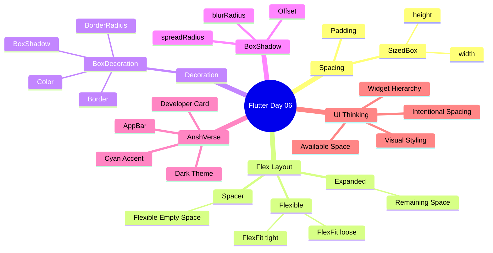

# 🚀 Flutter Day 06 — Detailed Notes

> **Topic:** Flexible Layouts, Spacing & Container Decoration  
> **Project:** Daily Learning App  
> **Practice UI:** AnshVerse Developer Card  
> **Status:** ✅ Completed

---

# 📚 Today's Learning

Aaj maine Flutter UI ko aur deeply samjha.

Aaj ka main focus tha:

- `SizedBox`
- `Expanded`
- `Flexible`
- `FlexFit.loose`
- `FlexFit.tight`
- `Spacer`
- `BoxDecoration`
- `BorderRadius`
- `Border`
- `BoxShadow`
- `blurRadius`
- `spreadRadius`
- `Offset`
- `Row + Column + Flexible`
- UI spacing
- Available space
- Developer-style UI

---

# 🧠 1. SizedBox

`SizedBox` ka use mostly **fixed space create karne** ke liye hota hai.

## Column ke andar

`Column` vertical direction mein kaam karta hai.

Isliye:

```dart
const SizedBox(
  height: 8,
)
```

vertical space create karega.

Example:

```dart
Column(
  children: [
    Text("Ansh Rastogi"),

    const SizedBox(
      height: 8,
    ),

    Text("Flutter Developer"),
  ],
)
```

Output concept:

```text
Ansh Rastogi

       ↓
    8 pixels

Flutter Developer
```

---

# ↔️ 2. SizedBox in Row

`Row` horizontal direction mein kaam karta hai.

Isliye:

```dart
const SizedBox(
  width: 20,
)
```

horizontal space create karega.

Example:

```dart
Row(
  children: [
    Text("🚀"),

    const SizedBox(
      width: 20,
    ),

    Text("AnshVerse"),
  ],
)
```

Concept:

```text
🚀        AnshVerse
    ↑
  20 px
```

---

# 🧠 Easy Rule

```text
Column → height
Row    → width
```

Yaad rakhne ka shortcut:

```text
Column
   ↓
Vertical
   ↓
height

Row
   ↓
Horizontal
   ↓
width
```

---

# 📦 3. Padding

`Padding` child ke around space create karta hai.

Example:

```dart
Padding(
  padding: const EdgeInsets.all(20),
  child: Text("Hello Ansh"),
)
```

Concept:

```text
┌─────────────────────────────┐
│                             │
│        Padding 20           │
│      ┌─────────────┐        │
│      │    Child    │        │
│      └─────────────┘        │
│                             │
└─────────────────────────────┘
```

Padding ka matlab:

> Child aur uske boundary ke beech space.

---

# 🧩 4. Expanded

`Expanded` ka use `Row` ya `Column` ke andar available remaining space lene ke liye hota hai.

Example:

```dart
Row(
  children: [
    const Text("🚀"),

    Expanded(
      child: Text("Ansh Rastogi"),
    ),

    const Text("🎯"),
  ],
)
```

Concept:

```text
┌──────────────────────────────────────────┐
│ 🚀 │        Expanded        │ 🎯 │
└──────────────────────────────────────────┘
          ↑
    Remaining Space
```

`Expanded` child ko available flex space fill karne ke liye kehta hai.

---

# ⚠️ Important Expanded Rule

`Expanded` ko normally `Row`, `Column` ya kisi Flex widget ka child hona chahiye.

Correct:

```dart
Row(
  children: [
    Expanded(
      child: Text("Hello"),
    ),
  ],
)
```

Incorrect:

```dart
Container(
  child: Expanded(
    child: Text("Hello"),
  ),
)
```

Reason:

`Expanded` ko flex layout ki information chahiye hoti hai.

---

# 🟢 5. Flexible

`Flexible` bhi available space ke saath kaam karta hai.

Example:

```dart
Flexible(
  child: Column(
    children: [
      Text("Ansh Rastogi"),
      Text("Flutter Developer"),
    ],
  ),
)
```

Iska purpose:

> Child ko flexible space provide karna.

---

# 🔗 6. FlexFit

`Flexible` ke andar `fit` property hoti hai.

Do important values:

```dart
FlexFit.loose
FlexFit.tight
```

---

# 🟢 FlexFit.loose

Example:

```dart
Flexible(
  fit: FlexFit.loose,
  child: Text("Flutter Developer"),
)
```

Meaning:

> Available space diya ja sakta hai, lekin child ko poora available space fill karna compulsory nahi hai.

Concept:

```text
Available Space
──────────────────────────────

   Child
  ────────

Remaining space
can remain unused.
```

---

# 🔥 FlexFit.tight

Example:

```dart
Flexible(
  fit: FlexFit.tight,
  child: Text("Flutter Developer"),
)
```

Meaning:

> Child ko available flex space fill karna padega.

Concept:

```text
Available Space
──────────────────────────────

┌──────────────────────────────┐
│            Child             │
└──────────────────────────────┘

       ↑
   Space Filled
```

---

# 🧠 Expanded vs Flexible

Important concept:

```dart
Expanded(
  child: MyWidget(),
)
```

Conceptually similar hai:

```dart
Flexible(
  fit: FlexFit.tight,
  child: MyWidget(),
)
```

Mental model:

```text
Flexible
│
├── FlexFit.loose
│      ↓
│   Flexible size
│
└── FlexFit.tight
       ↓
   Fill available flex space
       ↓
   Expanded-like behaviour
```

---

# ↔️ 7. Spacer

`Spacer` flexible empty space create karta hai.

Example:

```dart
Row(
  children: [
    Text("AnshVerse"),

    Spacer(),

    Text("🎭"),
  ],
)
```

Output:

```text
AnshVerse                         🎭
           ↑
      Flexible Space
```

`Spacer` ka use bahut common hai:

- AppBar
- Header
- Toolbar
- Navigation
- Cards
- Profile UI

---

# 🧠 Spacer vs SizedBox

### SizedBox

Fixed space:

```dart
SizedBox(
  width: 20,
)
```

Matlab:

```text
20 px fixed
```

### Spacer

Flexible space:

```dart
Spacer()
```

Matlab:

```text
Remaining available space
```

---

# 🎯 Easy Difference

```text
SizedBox
   ↓
Fixed Space


Spacer
   ↓
Flexible Space
```

---

# 🎨 8. BoxDecoration

Simple Container mein hum pehle:

```dart
Container(
  color: Colors.blueGrey,
)
```

use kar rahe the.

Lekin jab hume advanced styling karni ho to:

```dart
Container(
  decoration: BoxDecoration(
    color: Colors.blueGrey,
  ),
)
```

use kar sakte hain.

`BoxDecoration` se hum add kar sakte hain:

```text
BoxDecoration
│
├── color
├── border
├── borderRadius
├── boxShadow
├── gradient
└── image
```

Aaj humne mainly:

- color
- border
- borderRadius
- boxShadow

use kiya.

---

# 🔲 9. BorderRadius

Container ke corners ko rounded banane ke liye:

```dart
borderRadius: BorderRadius.circular(25),
```

use karte hain.

Without BorderRadius:

```text
┌───────────────────┐
│                   │
│      Card         │
│                   │
└───────────────────┘
```

With BorderRadius:

```text
╭───────────────────╮
│                   │
│      Card         │
│                   │
╰───────────────────╯
```

---

# 🖼️ 10. Border

Container ke around border add karne ke liye:

```dart
border: Border.all(
  color: Colors.cyanAccent,
  width: 1,
),
```

Yahan:

```text
color
  ↓
Border ka color

width
  ↓
Border ki thickness
```

---

# 🌑 11. BoxShadow

UI ko depth ya glow dene ke liye:

```dart
boxShadow: [
  BoxShadow(
    color: Colors.cyanAccent,
    blurRadius: 15,
    spreadRadius: 5,
    offset: Offset(0, 4),
  ),
],
```

use kiya.

---

# 🌫️ 12. blurRadius

```dart
blurRadius: 15
```

Shadow kitni soft/blurred hogi, ye control karta hai.

Low blur:

```text
████████
```

High blur:

```text
░▒▓████▓▒░
```

Simple:

> `blurRadius` → Shadow ki softness.

---

# 📡 13. spreadRadius

```dart
spreadRadius: 5
```

Shadow kitni distance tak outward spread karegi, ye control karta hai.

Concept:

```text
        Shadow
   ░░░░░░░░░░░░░
  ░  ┌────────┐  ░
  ░  │  CARD  │  ░
  ░  └────────┘  ░
   ░░░░░░░░░░░░░
```

Simple:

> `spreadRadius` → Shadow ka spread.

---

# 🧭 14. Offset

Example:

```dart
offset: Offset(0, 4),
```

Format:

```dart
Offset(x, y)
```

Meaning:

```text
x → Left / Right
y → Up / Down
```

Example:

```dart
Offset(0, 4)
```

Means:

```text
x = 0 → horizontal movement nahi

y = 4 → shadow downward
```

---

# 🎨 15. AnshVerse Color Theme

Aaj maine dark developer-style UI banayi.

## Background

```dart
const Color.fromARGB(255, 23, 46, 57)
```

## Card

```dart
const Color.fromARGB(255, 30, 60, 74)
```

## AppBar

```dart
Colors.black87
```

## Main Accent

```dart
Colors.cyanAccent
```

## Main Text

```dart
Colors.white
```

## Secondary Text

```dart
Colors.white70
```

---

# 🚀 16. AnshVerse AppBar

Aaj AppBar ko bhi improve kiya.

```dart
appBar: AppBar(
  toolbarHeight: 80,
  backgroundColor: Colors.black87,

  title: Row(
    children: [
      Text(
        "AnshVerse",
        style: TextStyle(
          color: Colors.cyanAccent,
          fontSize: 24,
        ),
      ),

      Spacer(),

      Text(
        "🎭",
        style: TextStyle(
          fontSize: 24,
        ),
      ),
    ],
  ),
),
```

Output concept:

```text
┌──────────────────────────────────────────┐
│ AnshVerse                             🎭 │
└──────────────────────────────────────────┘
```

`Spacer()` dono widgets ke beech available space le raha hai.

---

# 🧱 17. Today's Main UI Structure

Aaj ka main card kuch aisa structured tha:

```text
Container
│
├── BoxDecoration
│    ├── Color
│    ├── BorderRadius
│    ├── Border
│    └── BoxShadow
│
└── Row
     │
     ├── 🚀
     │
     ├── SizedBox
     │
     ├── Flexible
     │    │
     │    └── Column
     │         ├── Name
     │         ├── SizedBox
     │         ├── Goal
     │         ├── SizedBox
     │         └── Description
     │
     ├── SizedBox
     │
     └── 🎯
```

---

# 🌳 18. Widget Tree



---

# 🧠 19. Day 06 Concept Flow



---

# 🧠 20. Day 06 Mindmap



---

# 🧪 21. Experiments I Performed

Aaj sirf theory nahi padhi.

Maine properties ko practically change karke observe kiya.

### Experiments

- `Padding` remove karke observe kiya.
- `Expanded` observe kiya.
- `Flexible` observe kiya.
- `FlexFit.loose` observe kiya.
- `FlexFit.tight` observe kiya.
- Observe kiya ki `FlexFit.tight` ka behaviour `Expanded` jaisa ho sakta hai.
- `Spacer()` ko AppBar mein use kiya.
- `SizedBox` se horizontal spacing banayi.
- `SizedBox` se vertical spacing banayi.
- `BorderRadius` add kiya.
- `Border` add kiya.
- `BoxShadow` add kiya.
- `blurRadius` observe kiya.
- `spreadRadius` observe kiya.
- `Offset` observe kiya.
- `Row + Flexible + Column` combine kiya.
- Developer-style AnshVerse UI banayi.

---

# 🧠 22. Most Important Observation

Flutter UI banate waqt sirf widgets ke naam yaad karna enough nahi hai.

Mujhe ye sochna hai:

```text
Parent Widget
      ↓
Available Space
      ↓
Direction
      ↓
Children
      ↓
Space Distribution
      ↓
Spacing
      ↓
Decoration
      ↓
Final UI
```

Yahi actual UI building mindset hai.

---

# ⚡ 23. Quick Revision Table

| Concept | Easy Meaning |
|---|---|
| `SizedBox` | Fixed space |
| `Padding` | Child ke around space |
| `Expanded` | Remaining flex space fill karta hai |
| `Flexible` | Flexible space provide karta hai |
| `FlexFit.loose` | Full space lena compulsory nahi |
| `FlexFit.tight` | Available flex space fill karta hai |
| `Spacer` | Flexible empty space |
| `BoxDecoration` | Advanced container styling |
| `BorderRadius` | Rounded corners |
| `Border.all()` | Border |
| `BoxShadow` | Shadow / glow |
| `blurRadius` | Shadow softness |
| `spreadRadius` | Shadow spread |
| `Offset` | Shadow direction |

---

# 🧠 24. Easy Memory Tricks

### SizedBox

```text
Row → width
Column → height
```

### Expanded

```text
Remaining Space → Take It
```

### Flexible

```text
Available Space → Use Flexibly
```

### Spacer

```text
Widget ← SPACE → Widget
```

### BorderRadius

```text
Square → Rounded
```

### BoxShadow

```text
Card → Depth / Glow
```

### Offset

```text
(x, y)
```

---

# 🏆 25. What I Can Do After Day 06

Ab main basic UI ko sirf widgets se nahi bana raha.

Main samajhne laga hoon:

```text
Layout
+
Spacing
+
Available Space
+
Flex
+
Decoration
=
Better UI
```

Aur ye knowledge future mein:

- Login Screen
- Profile Screen
- Dashboard
- Portfolio
- Cards
- Settings Screen
- Home Screen

banane mein kaam aayegi.

---

# 🚀 26. AnshVerse Progress

AnshVerse ko gradually improve karna hai.

Current direction:

```text
Basic Flutter
      ↓
Row / Column
      ↓
Spacing
      ↓
Flexible Layout
      ↓
Decoration
      ↓
Beautiful Cards
      ↓
Reusable Components
      ↓
Real AnshVerse App
```

---

# 📊 Day 06 Checklist

- [x] SizedBox
- [x] Padding Revision
- [x] Expanded
- [x] Flexible
- [x] FlexFit.loose
- [x] FlexFit.tight
- [x] Spacer
- [x] BoxDecoration
- [x] BorderRadius
- [x] Border
- [x] BoxShadow
- [x] blurRadius
- [x] spreadRadius
- [x] Offset
- [x] Row + Column + Flexible
- [x] Developer-style UI
- [x] AnshVerse practice

---

# 🎯 Final Takeaway

Aaj ka sabse important concept:

> **Flutter UI mein space ko samajhna bahut important hai.**

`Row` aur `Column` sirf widgets ko arrange nahi karte.

Flutter continuously decide karta hai:

```text
Kitni Space Available Hai?
          ↓
Kis Direction Mein Layout Hai?
          ↓
Children Ko Kitni Space Milegi?
          ↓
Kaun Flexible Hai?
          ↓
Kaun Fixed Hai?
          ↓
Final UI
```

Aur uske baad:

```text
BoxDecoration
      ↓
Border
      ↓
Rounded Corners
      ↓
Shadow
      ↓
Beautiful UI 🚀
```

---

# 🔥 Day 06 Completed

**Flutter Journey — Day 06 ✅**

> **Learn → Code → Observe → Experiment → Understand → Build**

🚀 **Next Goal:** Continue building better Flutter UI and start thinking like a UI developer.