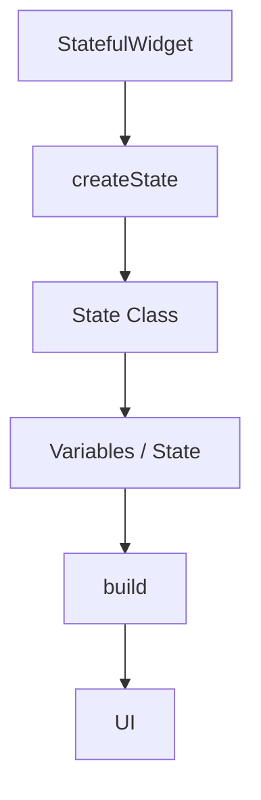
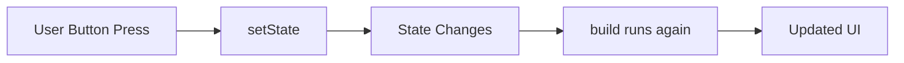
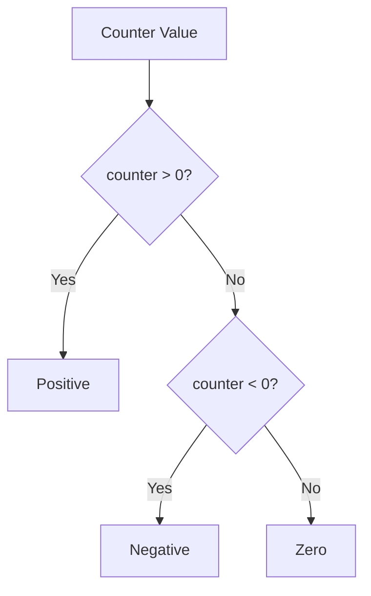
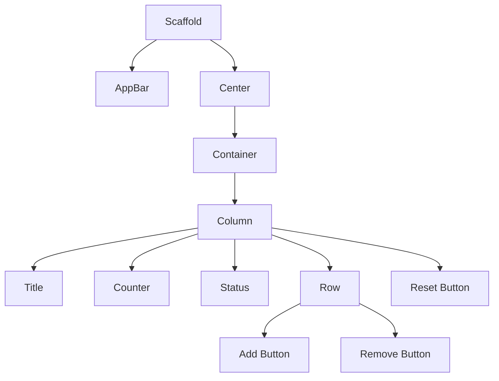
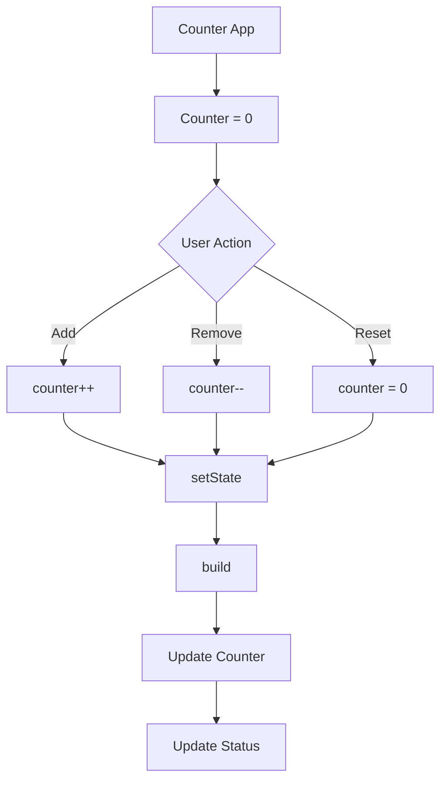

# 📘 Flutter Day 09 — StatefulWidget & setState()

## 🎯 Today's Goal

Aaj maine Flutter mein **dynamic UI** banana seekha — yani user ke action ke according screen ka data change karna.

---

## 🧠 1. StatefulWidget

Jab screen par koi data change hona ho, tab `StatefulWidget` use karte hain.

```dart
class Counterscreen extends StatefulWidget {
  const Counterscreen({super.key});

  @override
  State<Counterscreen> createState() => _CounterscreenState();
}
```


🔄 2. State Variable

State class ke andar wo variable rakha jata hai jo UI mein change hoga.

class _CounterscreenState extends State<Counterscreen> {
  int counter = 0;
  String status = "";
}

Yahan:

counter → current count store karta hai
status → Positive / Negative / Zero store karta hai
⚡ 3. setState()

setState() ka use state ko change karne ke liye kiya.

setState(() {
  counter++;
});

Counter change hone ke baad Flutter build() ko dobara run karta hai aur UI update hoti hai.

## setState Flow



➕ 4. Increment
```dart
IconButton(
  onPressed: () {
    setState(() {
      counter++;
    });
  },
  icon: Icon(Icons.add),
)
```
Har press par:

0 → 1 → 2 → 3 → 4
➖ 5. Decrement
```dart

IconButton(
  onPressed: () {
    setState(() {
      counter--;
    });
  },
  icon: Icon(Icons.remove),
)
```

Counter negative bhi ho sakta hai:

0 → -1 → -2 → -3
🔄 6. Reset
```dart

setState(() {
  counter = 0;
});
```
Isse counter dobara 0 ho jata hai.

🧩 7. Conditional Logic

Counter ke according status change kiya:
```dart
if (counter > 0) {
  status = "Positive";
} else if (counter < 0) {
  status = "Negative";
} else {
  status = "Zero";
}
```
Logic




🎨 8. UI Widgets Practiced

Aaj Counter App mein ye widgets use kiye:

Scaffold
AppBar
Center
Container
Column
Row
Text
SizedBox
IconButton
ElevatedButton
UI Structure



🏗️ Counter App Logic




📌 Key Takeaways
StatefulWidget

Changing data wali screen ke liye.

State

Screen ka changing data.

setState()

State change hone par UI ko update karne ke liye.

Important Pattern
```dart
setState(() {
  variable = newValue;
});
```
🏆 Day 09 Project
Counter App Features

✅ Increment
✅ Decrement
✅ Reset
✅ Positive Status
✅ Negative Status
✅ Zero Status
✅ Dynamic UI Update
✅ StatefulWidget
✅ setState()

📝 Day 09 Summary

Today I learned how to manage changing data in Flutter using StatefulWidget and setState(), and built an interactive Counter App with dynamic status.

Next 🚀

Day 10 → TextEditingController + User Input