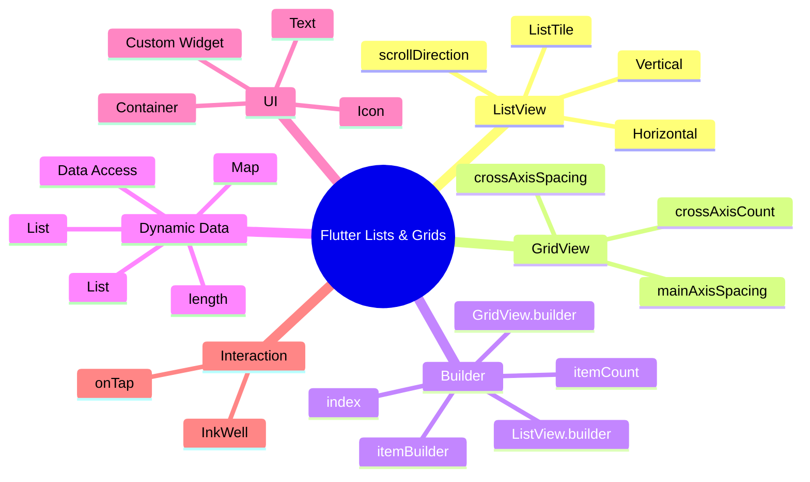
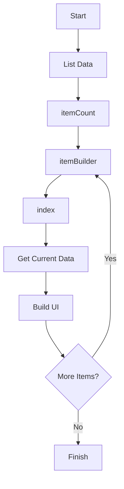

# 🚀 Flutter Journey — Day 13 Notes

## 📅 Day 13 — Lists, Grids & Dynamic UI

Aaj humne Flutter me **ListView aur GridView** ko practically explore kiya.

Starting me humne normal/static lists banayi, uske baad:

- ListView
- ListTile
- Horizontal ListView
- Custom Widget
- GridView
- GridView.builder
- ListView.builder
- Dynamic List Data
- `List<Map<String, dynamic>>`
- `itemCount`
- `itemBuilder`
- `index`
- Dynamic Icons
- Dynamic Colors
- `InkWell`
- `onTap`

jaise concepts practically implement kiye.

---

# 🧠 1. ListView

`ListView` Flutter ka ek scrollable widget hai.

Jab hume multiple widgets ko vertically ya horizontally display karna hota hai aur content screen se bada ho sakta hai, tab `ListView` useful hota hai.

### Basic Example

```dart
ListView(
  children: [
    Text("Food"),
    Text("Transport"),
    Text("Shopping"),
  ],
)
```

Flutter automatically in widgets ko scrollable list me arrange karta hai.

---

# 📌 2. ListView ka Basic Structure

```text
ListView
│
├── Item 1
├── Item 2
├── Item 3
├── Item 4
└── Item 5
```

Example:

```dart
ListView(
  children: [
    ListTile(
      title: Text("Food"),
    ),

    ListTile(
      title: Text("Transport"),
    ),

    ListTile(
      title: Text("Shopping"),
    ),
  ],
)
```

---

# 🧩 3. ListTile

`ListTile` ek ready-made row layout hai.

Isme commonly 3 major areas hote hain:

```text
┌────────────────────────────────────┐
│ Icon   Title                 Amount │
│        Subtitle                     │
└────────────────────────────────────┘
```

### Important Properties

```dart
ListTile(
  leading: Icon(Icons.restaurant),

  title: Text("Food"),

  subtitle: Text("Today"),

  trailing: Text("₹250"),
)
```

### Important Properties

| Property | Kaam |
|---|---|
| `leading` | Left side widget |
| `title` | Main text |
| `subtitle` | Title ke neeche text |
| `trailing` | Right side widget |
| `onTap` | Tap hone par action |
| `tileColor` | Tile ka background |
| `shape` | Tile ka shape |

---

# 🎨 4. ListTile Styling

Humne ListTile ko card jaisa look diya:

```dart
ListTile(
  tileColor: Colors.white,

  shape: RoundedRectangleBorder(
    borderRadius: BorderRadius.circular(16),
  ),

  title: Text("Food"),
)
```

Yaha:

```dart
tileColor: Colors.white
```

background white karta hai.

Aur:

```dart
borderRadius: BorderRadius.circular(16)
```

corners ko rounded karta hai.

---

# ↔️ 5. Horizontal ListView

ListView default me vertical hota hai.

Agar horizontal banana ho:

```dart
ListView(
  scrollDirection: Axis.horizontal,

  children: [
    Container(
      child: Text("All"),
    ),

    Container(
      child: Text("Food"),
    ),

    Container(
      child: Text("Transport"),
    ),
  ],
)
```

### Important

```dart
scrollDirection: Axis.horizontal
```

List ko horizontal direction me scroll kar deta hai.

---

# ⚠️ 6. Horizontal ListView ke saath Height

Horizontal ListView ko parent se height milni chahiye.

Example:

```dart
SizedBox(
  height: 50,

  child: ListView(
    scrollDirection: Axis.horizontal,

    children: [
      ...
    ],
  ),
)
```

Yaha `SizedBox` ListView ko fixed height de raha hai.

---

# 🧱 7. Custom Widget

Agar same UI baar-baar likhna pad raha ho to hum custom method/widget bana sakte hain.

Example:

```dart
Widget categoryChip(String title) {
  return Container(
    padding: EdgeInsets.symmetric(
      horizontal: 18,
      vertical: 12,
    ),

    decoration: BoxDecoration(
      color: Colors.white,
      borderRadius: BorderRadius.circular(20),
    ),

    child: Text(title),
  );
}
```

Ab hum baar-baar pura Container nahi likhenge.

Instead:

```dart
categoryChip("All"),
categoryChip("Food"),
categoryChip("Transport"),
categoryChip("Shopping"),
```

### Benefit

```text
Without Custom Widget

Container
Container
Container
Container
Container

        ↓

With Custom Widget

categoryChip()
categoryChip()
categoryChip()
categoryChip()
```

Isse code:

- Short
- Reusable
- Clean
- Maintainable

hota hai.

---

# 🟦 8. GridView

`GridView` items ko grid format me display karta hai.

Example:

```text
┌──────────┐  ┌──────────┐
│   Food   │  │Transport │
└──────────┘  └──────────┘

┌──────────┐  ┌──────────┐
│ Shopping │  │  Bills   │
└──────────┘  └──────────┘

┌──────────┐  ┌──────────┐
│ Internet │  │   Movie  │
└──────────┘  └──────────┘
```

---

# 🧩 9. GridView ka Basic Structure

```dart
GridView(
  gridDelegate:
      SliverGridDelegateWithFixedCrossAxisCount(
    crossAxisCount: 2,
  ),

  children: [
    Container(),
    Container(),
    Container(),
    Container(),
  ],
)
```

---

# 📐 10. crossAxisCount

```dart
crossAxisCount: 2
```

iska matlab hai ek row me 2 items.

Example:

```text
crossAxisCount = 2

┌──────┐ ┌──────┐
│  1   │ │  2   │
└──────┘ └──────┘

┌──────┐ ┌──────┐
│  3   │ │  4   │
└──────┘ └──────┘
```

Agar:

```dart
crossAxisCount: 3
```

to:

```text
┌────┐ ┌────┐ ┌────┐
│ 1  │ │ 2  │ │ 3  │
└────┘ └────┘ └────┘
```

---

# ↔️ 11. Grid Spacing

Humne GridView me spacing bhi use ki:

```dart
SliverGridDelegateWithFixedCrossAxisCount(
  crossAxisCount: 2,

  crossAxisSpacing: 10,

  mainAxisSpacing: 10,
)
```

### `crossAxisSpacing`

Columns ke beech ka gap.

### `mainAxisSpacing`

Rows ke beech ka gap.

---

# 🚀 12. ListView.builder

Normal ListView me hume manually items likhne padte hain.

```dart
ListView(
  children: [
    Text("Item 1"),
    Text("Item 2"),
    Text("Item 3"),
    Text("Item 4"),
  ],
)
```

Lekin agar items dynamic hain to ye approach practical nahi hai.

Isliye:

```dart
ListView.builder()
```

use karte hain.

---

# 🧠 13. ListView.builder ka Concept

```dart
ListView.builder(
  itemCount: 20,

  itemBuilder: (context, index) {
    return Text(
      "Item ${index + 1}",
    );
  },
)
```

Yaha Flutter ko hum keh rahe hain:

> Mere paas 20 items hain aur har item ko is builder function se create karo.

---

# 🔢 14. itemCount

```dart
itemCount: 20
```

batata hai ki total kitne items banane hain.

Example:

```dart
itemCount: 5
```

to:

```text
Item 1
Item 2
Item 3
Item 4
Item 5
```

---

# 🔢 15. index

`index` har item ki position batata hai.

Normally indexing `0` se start hoti hai.

```text
index = 0 → Item 1
index = 1 → Item 2
index = 2 → Item 3
index = 3 → Item 4
```

Isliye humne likha:

```dart
"Item ${index + 1}"
```

Agar:

```text
index = 0
```

to:

```text
0 + 1 = 1
```

Output:

```text
Item 1
```

---

# 🔄 16. itemBuilder

```dart
itemBuilder: (context, index) {
  return Text(
    "Item ${index + 1}",
  );
}
```

`itemBuilder` decide karta hai ki **har index par kya UI banana hai**.

Simple language me:

```text
itemCount
    ↓
Kitne items?

itemBuilder
    ↓
Har item ka UI kya hoga?

index
    ↓
Abhi kaunsa item ban raha hai?
```

---

# 📦 17. Dynamic List Data

Ab humne static text ki jagah data list use ki.

```dart
List<String> expenses = [
  "Food",
  "Transport",
  "Shopping",
  "Bills",
  "Entertainment",
  "Internet",
];
```

Phir:

```dart
ListView.builder(
  itemCount: expenses.length,

  itemBuilder: (context, index) {
    return Text(
      expenses[index],
    );
  },
)
```

---

# 🧠 18. expenses.length

```dart
itemCount: expenses.length
```

Bahut important concept hai.

Agar:

```dart
expenses.length
```

6 hai to builder 6 items create karega.

Agar list me kal 10 items add ho gaye:

```dart
expenses.length
```

automatically 10 ho jayega.

Isliye manually:

```dart
itemCount: 6
```

likhne ki zarurat nahi.

---

# 🗂️ 19. List<Map<String, dynamic>>

Real applications me ek item ke andar multiple information hoti hai.

Example:

```text
Food
₹250
Today
Restaurant Icon
Orange Color
```

Isliye humne:

```dart
List<Map<String, dynamic>> expenses = [
  {
    "title": "Food",
    "amount": 250,
    "date": "Today",
    "icon": Icons.restaurant,
    "iconColor": Colors.orange,
  },

  {
    "title": "Transport",
    "amount": 120,
    "date": "Today",
    "icon": Icons.directions_car,
    "iconColor": Colors.blue,
  },
];
```

use kiya.

---

# 🧩 20. Map kya kar raha hai?

Ek Map ek expense ki complete information store kar raha hai.

Example:

```dart
{
  "title": "Food",
  "amount": 250,
  "date": "Today",
  "icon": Icons.restaurant,
  "iconColor": Colors.orange,
}
```

Isko ek object jaisa temporarily samajh sakte hain:

```text
Food Expense
│
├── title
├── amount
├── date
├── icon
└── iconColor
```

---

# 🔑 21. Map se Data Access

Example:

```dart
expenses[index]["title"]
```

Matlab:

```text
expenses
   ↓
current index
   ↓
"title"
   ↓
Food
```

Similarly:

```dart
expenses[index]["amount"]
```

Output:

```text
250
```

Aur:

```dart
expenses[index]["icon"]
```

icon return karega.

---

# 🎨 22. Dynamic Colors

Humne colors ko bhi data ke andar store kiya:

```dart
"iconColor": Colors.orange
```

Aur UI me:

```dart
Icon(
  expenses[index]["icon"],
  color: expenses[index]["iconColor"],
)
```

Ab har item ka icon automatically different color me aa sakta hai.

Example:

```text
Food         → Orange
Transport    → Blue
Shopping     → Purple
Entertainment→ Red
Electricity  → Yellow
Internet     → Green
```

---

# 🟩 23. GridView.builder

Jaise:

```dart
ListView.builder
```

dynamic list banata hai,

waise hi:

```dart
GridView.builder
```

dynamic grid banata hai.

Basic structure:

```dart
GridView.builder(
  itemCount: expenses.length,

  gridDelegate:
      SliverGridDelegateWithFixedCrossAxisCount(
    crossAxisCount: 2,
  ),

  itemBuilder: (context, index) {
    return Container();
  },
)
```

---

# 🧠 24. GridView.builder ka Flow

```text
List Data
   │
   ▼
itemCount
   │
   ▼
itemBuilder
   │
   ▼
index
   │
   ▼
Current Data
   │
   ▼
UI Card
```

---

# 🖱️ 25. InkWell

Grid ke kisi card par tap action perform karne ke liye humne:

```dart
InkWell(
  onTap: () {
    print("Food Tapped");
  },

  child: Container(),
)
```

use kiya.

`InkWell` kisi widget ko interactive/tappable bana sakta hai.

---

# 📱 26. onTap

`onTap` tab execute hota hai jab user widget par tap karta hai.

Example:

```dart
onTap: () {
  print("Food Tapped");
}
```

Dynamic list/grid me:

```dart
onTap: () {
  print(
    "${expenses[index]["title"]} Tapped"
  );
}
```

Ab jis card par tap hoga uska naam print hoga.

Example:

```text
Food Tapped

Transport Tapped

Shopping Tapped
```

---

# 🌳 27. GridView.builder Widget Tree

```text
Scaffold
│
├── AppBar
│
└── Body
    │
    └── SafeArea
        │
        └── Padding
            │
            └── Column
                │
                ├── Text
                │
                ├── SizedBox
                │
                └── Expanded
                    │
                    └── GridView.builder
                        │
                        └── itemBuilder
                            │
                            └── InkWell
                                │
                                └── Container
                                    │
                                    └── Column
                                        │
                                        ├── Icon
                                        ├── SizedBox
                                        ├── Text
                                        ├── SizedBox
                                        └── Text
```

---

# 🧠 28. Mind Map



---

# 🔄 29. Builder Working Flow



---

# 🧩 30. Normal ListView vs ListView.builder

| Normal ListView | ListView.builder |
|---|---|
| Static items ke liye useful | Dynamic items ke liye useful |
| Children manually likhte hain | `itemBuilder` use hota hai |
| Small fixed data | Large/dynamic data |
| `children` | `itemCount` + `itemBuilder` |

Example:

### Normal

```dart
ListView(
  children: [
    Text("Food"),
    Text("Transport"),
    Text("Shopping"),
  ],
)
```

### Builder

```dart
ListView.builder(
  itemCount: expenses.length,

  itemBuilder: (context, index) {
    return Text(
      expenses[index],
    );
  },
)
```

---

# 🧩 31. Normal GridView vs GridView.builder

### Normal GridView

```dart
GridView(
  gridDelegate:
      SliverGridDelegateWithFixedCrossAxisCount(
    crossAxisCount: 2,
  ),

  children: [
    Container(),
    Container(),
    Container(),
  ],
)
```

### GridView.builder

```dart
GridView.builder(
  itemCount: expenses.length,

  gridDelegate:
      SliverGridDelegateWithFixedCrossAxisCount(
    crossAxisCount: 2,
  ),

  itemBuilder: (context, index) {
    return Container();
  },
)
```

---

# 🎯 32. Aaj ka Main Concept

Aaj ka sabse important concept:

```text
DATA
 ↓
LIST
 ↓
itemCount
 ↓
itemBuilder
 ↓
index
 ↓
CURRENT DATA
 ↓
UI
```

Example:

```dart
expenses[index]["title"]
```

Is line ko properly samajhna important hai.

---

# 🧠 33. Real World Example

Real application me server se data aa sakta hai:

```text
Food
₹250
Today

Transport
₹120
Today

Shopping
₹700
Yesterday
```

Hum future me isi data ko:

```dart
List<Model>
```

ya JSON se load karenge.

Phir:

```dart
ListView.builder()
```

ya:

```dart
GridView.builder()
```

se UI generate karenge.

---

# 🚀 34. Future JSON Connection

Aaj humne data manually banaya:

```dart
List<Map<String, dynamic>> expenses = [
  {
    "title": "Food",
    "amount": 250,
  },
];
```

Future me same data JSON se aa sakta hai:

```json
[
  {
    "title": "Food",
    "amount": 250
  }
]
```

Phir Flutter:

```text
JSON
 ↓
Dart Data
 ↓
List / Model
 ↓
ListView.builder
 ↓
UI
```

Isi reason ki wajah se aaj ka Builder concept future API development me bahut important hai.

---

# 📝 35. Important Things to Remember

### ListView

```dart
ListView()
```

Scrollable list ke liye.

### Horizontal List

```dart
scrollDirection: Axis.horizontal
```

### GridView

```dart
GridView()
```

Grid layout ke liye.

### Grid Columns

```dart
crossAxisCount: 2
```

### Dynamic List

```dart
ListView.builder()
```

### Dynamic Grid

```dart
GridView.builder()
```

### Number of Items

```dart
itemCount
```

### Item Creation

```dart
itemBuilder
```

### Current Position

```dart
index
```

### Dynamic Data

```dart
expenses[index]["title"]
```

### Tap Interaction

```dart
InkWell(
  onTap: () {},
)
```

---

# ⚠️ 36. Common Mistakes

## Mistake 1

```dart
itemCount: 20
```

jab actual list:

```dart
expenses
```

ki length different ho.

Better:

```dart
itemCount: expenses.length
```

---

## Mistake 2

Index ko directly data samajhna.

Wrong:

```dart
Text(index)
```

`index` integer hota hai.

Correct:

```dart
Text("${index + 1}")
```

ya:

```dart
Text(expenses[index])
```

---

## Mistake 3

Map key galat likhna.

Agar data:

```dart
{
  "title": "Food"
}
```

to:

```dart
expenses[index]["title"]
```

use karna hoga.

---

## Mistake 4

GridView.builder me `gridDelegate` bhool jaana.

```dart
GridView.builder(
  gridDelegate:
      SliverGridDelegateWithFixedCrossAxisCount(
    crossAxisCount: 2,
  ),

  itemBuilder: ...
)
```

---

# 🏆 37. Day 13 Learning Outcome

Day 13 ke end tak mujhe samajh aa gaya:

- ListView kya hai
- ListView ko horizontal kaise karte hain
- ListTile kya hai
- ListTile ki important properties
- Custom widget/method kya hota hai
- GridView kya hai
- `crossAxisCount`
- `crossAxisSpacing`
- `mainAxisSpacing`
- ListView.builder
- GridView.builder
- `itemCount`
- `itemBuilder`
- `index`
- Dynamic List
- `List<Map<String, dynamic>>`
- Map se data access
- Dynamic Icons
- Dynamic Colors
- InkWell
- onTap
- Builder ka basic working flow

---

# 🔥 38. Day 13 Summary

Aaj humne static UI se dynamic UI ki taraf move kiya.

Starting:

```text
Manually written widgets
```

Then:

```text
ListView
```

Then:

```text
GridView
```

Then:

```text
ListView.builder
```

Then:

```text
GridView.builder
```

Aur finally:

```text
Dynamic Data
      ↓
Builder
      ↓
Dynamic UI
      ↓
User Interaction
```

Ye concept Flutter app development me bahut important foundation hai.

---

# 🎯 Next Learning Direction

Next major concept:

```text
JSON Parsing
    ↓
JSON → Dart
    ↓
Dynamic Data
    ↓
Models
    ↓
List<Model>
    ↓
ListView.builder
    ↓
Real App UI
```

Iske baad hum gradually API development ki taraf move karenge. 🚀