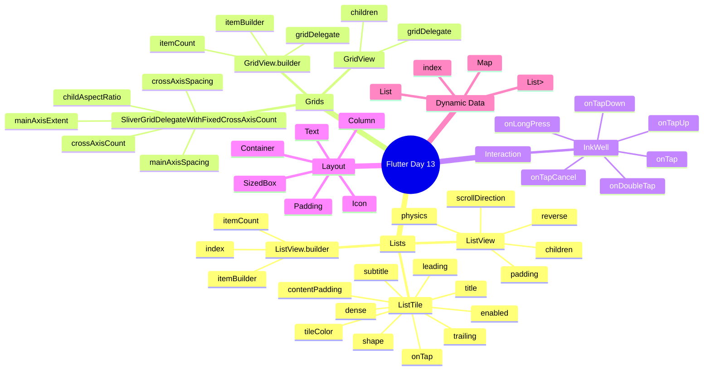
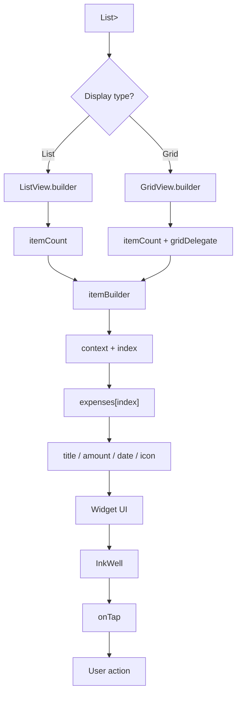
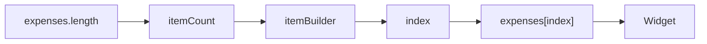
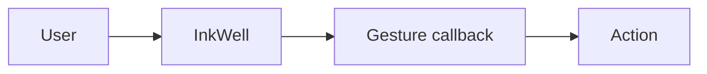
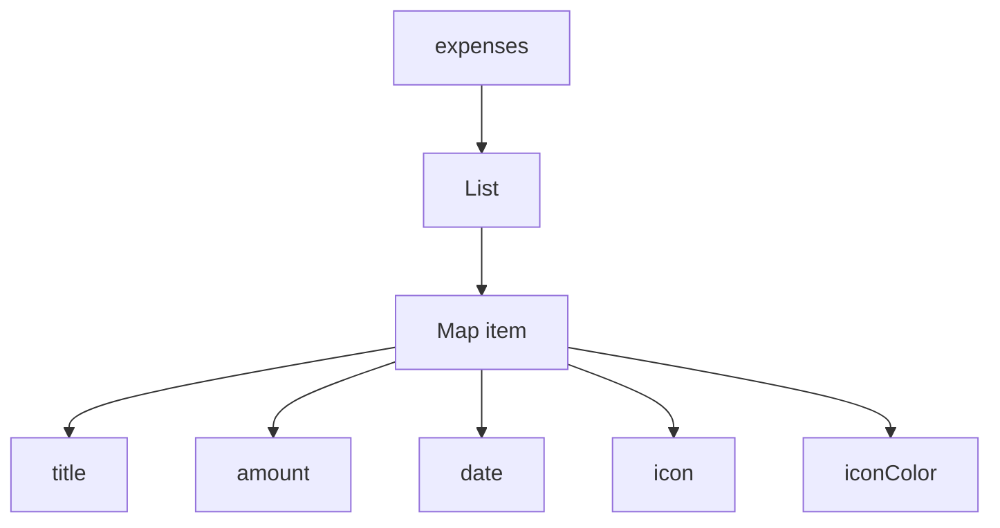
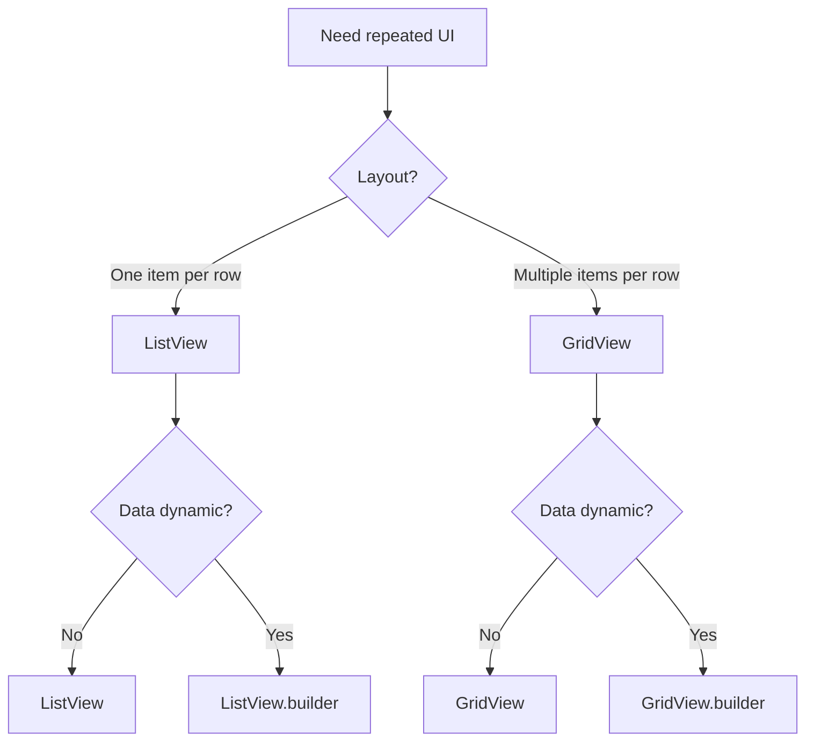

```
```

````
# 🧩 Flutter Widget Info — Day 13

## 📅 Day 13 — Lists, Grids & Dynamic UI

Aaj humne Flutter ke Lists, Grids aur Dynamic UI ke liye important widgets aur properties seekhi.

### Today's Widgets

- ListView
- ListTile
- GridView
- ListView.builder
- GridView.builder
- SliverGridDelegateWithFixedCrossAxisCount
- InkWell
- Container
- SizedBox
- Padding
- Column
- Icon
- Text

---

# 1. 📜 ListView

`ListView` ek scrollable widget hai jo widgets ko list ke form me display karta hai.

### Basic Example

```dart
ListView(
  children: [
    Text("Food"),
    Text("Transport"),
    Text("Shopping"),
  ],
)
````

### Important Properties

| PropertyKaam      |                                                |
| ----------------- | ---------------------------------------------- |
| `children`        | List ke andar widgets provide karta hai        |
| `scrollDirection` | Scroll ki direction decide karta hai           |
| `padding`         | List ke around space deta hai                  |
| `reverse`         | List ko reverse direction me display karta hai |
| `physics`         | Scrolling behaviour control karta hai          |

### Default Direction

```
```

```
ListView()
```

Default:

```
```

```
↓
↓
↓
Vertical
```

### Horizontal List

```
```

```
ListView(
  scrollDirection: Axis.horizontal,
  children: [
    ...
  ],
)
```

Result:

```
```

```
→ → → → →
Horizontal
```

---

# 2. 🧱 ListTile

`ListTile` ek ready-made row layout hai.

Iska use mostly list items ke liye hota hai.

### Example

```
```

```
ListTile(
  leading: Icon(Icons.restaurant),
  title: Text("Food"),
  subtitle: Text("Today"),
  trailing: Text("₹250"),
)
```

### Structure

```
```

```
┌──────────────────────────────────┐
│  leading   Title          trailing│
│            Subtitle               │
└──────────────────────────────────┘
```

### Important Properties

| PropertyKaam     |                                  |
| ---------------- | -------------------------------- |
| `leading`        | Left side widget                 |
| `title`          | Main content                     |
| `subtitle`       | Title ke neeche content          |
| `trailing`       | Right side widget                |
| `onTap`          | Tap hone par action              |
| `tileColor`      | Background color                 |
| `shape`          | Tile ka shape                    |
| `contentPadding` | Andar ka spacing                 |
| `dense`          | Tile ko compact banata hai       |
| `enabled`        | Tile ko enable/disable karta hai |

### Leading

```
```

```
leading: Icon(Icons.restaurant)
```

Left side me icon/widget show karta hai.

### Title

```
```

```
title: Text("Food")
```

Main text.

### Subtitle

```
```

```
subtitle: Text("Today")
```

Title ke neeche secondary text.

### Trailing

```
```

```
trailing: Text("₹250")
```

Right side me widget.

### onTap

```
```

```
onTap: () {
  print("Food tapped");
}
```

Tile par tap hone par execute hota hai.

---

# 3. 🟦 GridView

`GridView` widgets ko grid format me display karta hai.

Example:

```
```

```
┌──────────┐ ┌──────────┐
│   Food   │ │Transport │
└──────────┘ └──────────┘

┌──────────┐ ┌──────────┐
│ Shopping │ │  Bills   │
└──────────┘ └──────────┘
```

### Basic Example

```
```

```
GridView(
  gridDelegate:
      SliverGridDelegateWithFixedCrossAxisCount(
    crossAxisCount: 2,
  ),

  children: [
    Container(),
    Container(),
    Container(),
  ],
)
```

---

# 4. 📐 SliverGridDelegateWithFixedCrossAxisCount

Ye GridView ko batata hai ki grid ka layout kaisa hona chahiye.

Example:

```
```

```
SliverGridDelegateWithFixedCrossAxisCount(
  crossAxisCount: 2,
)
```

### Important Properties

| PropertyKaam       |                              |
| ------------------ | ---------------------------- |
| `crossAxisCount`   | Ek row/column me kitne items |
| `crossAxisSpacing` | Columns ke beech gap         |
| `mainAxisSpacing`  | Rows ke beech gap            |
| `mainAxisExtent`   | Item ki fixed main-axis size |
| `childAspectRatio` | Item ka width/height ratio   |

---

## crossAxisCount

```
```

```
crossAxisCount: 2
```

Matlab ek row me 2 items.

```
```

```
┌──────┐ ┌──────┐
│  1   │ │  2   │
└──────┘ └──────┘
```

Agar:

```
```

```
crossAxisCount: 3
```

to:

```
```

```
┌────┐ ┌────┐ ┌────┐
│ 1  │ │ 2  │ │ 3  │
└────┘ └────┘ └────┘
```

---

## crossAxisSpacing

```
```

```
crossAxisSpacing: 10
```

Columns ke beech ka horizontal gap.

```
```

```
┌──────┐ 10px ┌──────┐
│      │      │      │
└──────┘      └──────┘
```

---

## mainAxisSpacing

```
```

```
mainAxisSpacing: 10
```

Rows ke beech ka vertical gap.

```
```

```
┌──────┐
│      │
└──────┘
   ↑
  10px
   ↓
┌──────┐
│      │
└──────┘
```

---

## mainAxisExtent

```
```

```
mainAxisExtent: 150
```

Grid item ki main-axis size ko control karta hai.

---

## childAspectRatio

```
```

```
childAspectRatio: 1.2
```

Grid item ka width/height ratio control karta hai.

---

# 5. 🚀 ListView\.builder

`ListView.builder` dynamic lists banane ke liye use hota hai.

### Basic Example

```
```

```
ListView.builder(
  itemCount: 20,

  itemBuilder: (context, index) {
    return Text(
      "Item ${index + 1}",
    );
  },
)
```

---

## itemCount

```
```

```
itemCount: 20
```

Batata hai ki total kitne items hain.

Dynamic data ke saath:

```
```

```
itemCount: expenses.length
```

use karna better hai.

---

## itemBuilder

```
```

```
itemBuilder: (context, index) {
  return Text("Item");
}
```

Ye decide karta hai ki har item ka UI kya hoga.

---

## index

```
```

```
index
```

Current item ki position/index batata hai.

Index `0` se start hota hai.

```
```

```
index 0 → First item
index 1 → Second item
index 2 → Third item
```

Example:

```
```

```
Text(expenses[index])
```

---

# 6. 🏗️ GridView\.builder

`GridView.builder` dynamic grid banane ke liye use hota hai.

### Basic Structure

```
```

```
GridView.builder(
  itemCount: expenses.length,

  gridDelegate:
      SliverGridDelegateWithFixedCrossAxisCount(
    crossAxisCount: 2,
  ),

  itemBuilder: (context, index) {
    return Container();
  },
)
```

### Important Properties

| PropertyKaam   |                |
| -------------- | -------------- |
| `itemCount`    | Total items    |
| `itemBuilder`  | Item ka UI     |
| `gridDelegate` | Grid ka layout |

---

# 7. 🖱️ InkWell

`InkWell` kisi widget ko interactive/tappable banane ke liye use hota hai.

Example:

```
```

```
InkWell(
  onTap: () {
    print("Tapped");
  },

  child: Container(
    child: Text("Food"),
  ),
)
```

### Common Properties

| PropertyKaam  |             |
| ------------- | ----------- |
| `onTap`       | Single tap  |
| `onDoubleTap` | Double tap  |
| `onLongPress` | Long press  |
| `onTapDown`   | Tap start   |
| `onTapUp`     | Tap release |
| `onTapCancel` | Tap cancel  |

---

# 8. 👆 onTap

```
```

```
onTap: () {
  print("Food Tapped");
}
```

User widget par tap karega to function execute hoga.

Dynamic Grid me:

```
```

```
onTap: () {
  print(
    "${expenses[index]["title"]} Tapped"
  );
}
```

Isse jis item par tap hoga uska title milega.

---

# 9. 📦 Container

`Container` ek general-purpose UI widget hai.

Iska use:

-  Background 
-  Size 
-  Padding 
-  Margin 
-  Border 
-  Border Radius 
-  Shadow 

etc. ke liye hota hai.

### Example

```
```

```
Container(
  padding: EdgeInsets.all(16),

  decoration: BoxDecoration(
    color: Colors.white,
    borderRadius: BorderRadius.circular(16),
  ),

  child: Text("Food"),
)
```

### Important Properties

| PropertyKaam |                  |
| ------------ | ---------------- |
| `width`      | Width            |
| `height`     | Height           |
| `padding`    | Internal space   |
| `margin`     | External space   |
| `color`      | Background color |
| `decoration` | Advanced styling |
| `alignment`  | Child alignment  |
| `child`      | Inside widget    |

---

# 10. 📏 SizedBox

`SizedBox` fixed size ya spacing dene ke liye use hota hai.

### Spacing

```
```

```
SizedBox(
  height: 10,
)
```

Vertical gap.

### Horizontal Gap

```
```

```
SizedBox(
  width: 10,
)
```

Horizontal gap.

### Fixed Size

```
```

```
SizedBox(
  height: 100,
  width: 100,
  child: Container(),
)
```

---

# 11. 📦 Padding

`Padding` child ke around internal space create karta hai.

Example:

```
```

```
Padding(
  padding: EdgeInsets.all(16),
  child: Text("Food"),
)
```

### Common EdgeInsets

```
```

```
EdgeInsets.all(16)
```

Har side 16.

```
```

```
EdgeInsets.symmetric(
  horizontal: 16,
  vertical: 10,
)
```

Horizontal aur vertical separately.

```
```

```
EdgeInsets.only(
  left: 10,
  top: 20,
)
```

Specific sides.

---

# 12. 📊 Column

`Column` widgets ko vertically arrange karta hai.

```
```

```
Column(
  children: [
    Icon(Icons.restaurant),
    Text("Food"),
    Text("₹250"),
  ],
)
```

Result:

```
```

```
Icon
 ↓
Food
 ↓
₹250
```

### Important Properties

| PropertyKaam         |                            |
| -------------------- | -------------------------- |
| `children`           | Child widgets              |
| `mainAxisAlignment`  | Vertical arrangement       |
| `crossAxisAlignment` | Horizontal alignment       |
| `mainAxisSize`       | Available height behaviour |

---

# 13. 🎨 Icon

`Icon` icon display karta hai.

Example:

```
```

```
Icon(
  Icons.restaurant,
  size: 35,
  color: Colors.orange,
)
```

### Important Properties

| PropertyKaam    |                       |
| --------------- | --------------------- |
| `icon`          | Icon select karta hai |
| `size`          | Icon size             |
| `color`         | Icon color            |
| `semanticLabel` | Accessibility label   |

---

# 14. 📝 Text

Text display karne ke liye `Text` widget use hota hai.

```
```

```
Text(
  "Food",
  style: TextStyle(
    fontSize: 16,
    fontWeight: FontWeight.bold,
  ),
)
```

### Important TextStyle Properties

| PropertyKaam    |                          |
| --------------- | ------------------------ |
| `fontSize`      | Text size                |
| `fontWeight`    | Boldness                 |
| `color`         | Text color               |
| `letterSpacing` | Letters ke beech spacing |
| `height`        | Line height              |
| `fontStyle`     | Normal/italic            |

---

# 15. 🗂️ Dynamic Data

Humne data ko list ke andar Map ke form me store kiya.

```
```

```
List<Map<String, dynamic>> expenses = [
  {
    "title": "Food",
    "amount": 250,
    "date": "Today",
    "icon": Icons.restaurant,
    "iconColor": Colors.orange,
  },
];
```

### Data Access

```
```

```
expenses[index]["title"]
```

```
```

```
expenses[index]["amount"]
```

```
```

```
expenses[index]["date"]
```

```
```

```
expenses[index]["icon"]
```

```
```

```
expenses[index]["iconColor"]
```

---

# 16. 🔄 Dynamic UI Flow

```
```

```
List<Map<String, dynamic>>
          ↓
      itemCount
          ↓
      itemBuilder
          ↓
        index
          ↓
  expenses[index]
          ↓
     Map Data
          ↓
        UI
```

---

# 17. 🧠 Builder Concept

Builder widgets ka basic idea:

```
```

```
Data
 │
 ▼
itemCount
 │
 ▼
itemBuilder
 │
 ▼
index
 │
 ▼
Current Item
 │
 ▼
Widget
```

Example:

```
```

```
ListView.builder(
  itemCount: expenses.length,

  itemBuilder: (context, index) {
    return Text(
      expenses[index]["title"],
    );
  },
)
```

---

# 18. 📱 ListView vs GridView

| ListViewGridView             |                                    |
| ---------------------------- | ---------------------------------- |
| List format                  | Grid format                        |
| Usually one item per row     | Multiple items per row             |
| Expenses list ke liye useful | Categories/products ke liye useful |
| Vertical/Horizontal          | Grid layout                        |

---

# 19. ⚡ Normal vs Builder

## ListView

```
```

```
ListView(
  children: [
    Text("Food"),
    Text("Transport"),
    Text("Shopping"),
  ],
)
```

## ListView\.builder

```
```

```
ListView.builder(
  itemCount: expenses.length,

  itemBuilder: (context, index) {
    return Text(
      expenses[index]["title"],
    );
  },
)
```

---

## GridView

```
```

```
GridView(
  gridDelegate:
      SliverGridDelegateWithFixedCrossAxisCount(
    crossAxisCount: 2,
  ),

  children: [
    Container(),
    Container(),
    Container(),
  ],
)
```

## GridView\.builder

```
```

```
GridView.builder(
  itemCount: expenses.length,

  gridDelegate:
      SliverGridDelegateWithFixedCrossAxisCount(
    crossAxisCount: 2,
  ),

  itemBuilder: (context, index) {
    return Container();
  },
)
```

---

# 🧠 20. Quick Revision

```
```

```
ListView
    ↓
Scrollable List

ListTile
    ↓
Ready-made List Row

GridView
    ↓
Grid Layout

ListView.builder
    ↓
Dynamic List

GridView.builder
    ↓
Dynamic Grid

itemCount
    ↓
Kitne items?

itemBuilder
    ↓
Item ka UI?

index
    ↓
Current item?

InkWell
    ↓
Tap Interaction

onTap
    ↓
Tap hone par action

crossAxisCount
    ↓
Ek row me kitne items?

crossAxisSpacing
    ↓
Columns ke beech gap

mainAxisSpacing
    ↓
Rows ke beech gap

List<Map<String, dynamic>>
    ↓
Multiple data fields
```

---

# 🎯 Day 13 Most Important Properties

## ListView

```
```

```
children
scrollDirection
padding
physics
reverse
```

## ListTile

```
```

```
leading
title
subtitle
trailing
onTap
tileColor
shape
contentPadding
```

## GridView

```
```

```
gridDelegate
children
```

## SliverGridDelegateWithFixedCrossAxisCount

```
```

```
crossAxisCount
crossAxisSpacing
mainAxisSpacing
mainAxisExtent
childAspectRatio
```

## ListView\.builder

```
```

```
itemCount
itemBuilder
```

## GridView\.builder

```
```

```
itemCount
gridDelegate
itemBuilder
```

## InkWell

```
```

```
onTap
onDoubleTap
onLongPress
onTapDown
onTapUp
onTapCancel
```

## Container

```
```

```
width
height
padding
margin
color
decoration
alignment
child
```

---

# 🏆 Day 13 Key Takeaway

Flutter me static UI se dynamic UI ki taraf move karne ke liye:

```
```

```
List
 ↓
Map
 ↓
List<Map>
 ↓
Builder
 ↓
index
 ↓
Dynamic Data
 ↓
Dynamic Widget
```

Aur user interaction ke liye:

```
```

```
InkWell
   ↓
onTap
   ↓
Action
```

Ye concepts future me:

```
```

```
JSON
 ↓
Models
 ↓
API
 ↓
List<Model>
 ↓
ListView.builder
 ↓
Real App UI
```

me directly use honge. 🚀

---

# 🧠 Day 13 — Visual Learning Map



# 🌳 Dynamic UI Architecture



# 📌 Widget Property Reference

## ListView

| Property | Meaning | Typical use |
|---|---|---|
| `children` | Direct child widgets | Small/static lists |
| `scrollDirection` | Scroll direction | Vertical/horizontal list |
| `padding` | Space around list content | Screen/list spacing |
| `reverse` | Reverses display/scroll direction | Special list ordering |
| `physics` | Controls scroll behaviour | Custom scrolling behaviour |

### Mental Model

```text
ListView
   ↓
Scrollable
   ↓
Multiple Widgets
```

---

## ListTile

| Property | Meaning | Example |
|---|---|---|
| `leading` | Left-side widget | `Icon(...)` |
| `title` | Main content | `Text("Food")` |
| `subtitle` | Secondary content | `Text("Today")` |
| `trailing` | Right-side widget | `Text("₹250")` |
| `onTap` | Tap callback | `() { ... }` |
| `tileColor` | Tile background | `Colors.white` |
| `shape` | Tile shape | `RoundedRectangleBorder(...)` |
| `contentPadding` | Internal spacing | `EdgeInsets.all(16)` |
| `dense` | More compact layout | `true` |
| `enabled` | Enables/disables interaction | `false` |

### Mental Model

```text
ListTile
│
├── leading     → Left
├── title       → Main
├── subtitle    → Secondary
└── trailing    → Right
```

---

## GridView

| Property | Meaning |
|---|---|
| `children` | Direct grid children |
| `gridDelegate` | Defines grid layout |

Basic structure:

```dart
GridView(
  gridDelegate:
      SliverGridDelegateWithFixedCrossAxisCount(
    crossAxisCount: 2,
  ),
  children: [
    Container(),
    Container(),
  ],
)
```

---

## SliverGridDelegateWithFixedCrossAxisCount

| Property | Meaning |
|---|---|
| `crossAxisCount` | Number of items across the cross axis |
| `crossAxisSpacing` | Space between columns |
| `mainAxisSpacing` | Space between rows |
| `mainAxisExtent` | Fixed main-axis extent of each child |
| `childAspectRatio` | Width/height ratio of children |

### Visual Relationship

```text
crossAxisCount
      ↓
┌────┬────┐
│ 1  │ 2  │
└────┴────┘

crossAxisSpacing
      ↓
┌────┐  gap  ┌────┐
│    │        │    │
└────┘        └────┘

mainAxisSpacing
      ↓
┌──────┐
│      │
└──────┘
   gap
┌──────┐
│      │
└──────┘
```

---

## ListView.builder

| Property | Meaning |
|---|---|
| `itemCount` | Number of items to build |
| `itemBuilder` | Builds each item |
| `index` | Current item's position |

### Flow



### Important

Index `0` se start hota hai:

```text
0 → First item
1 → Second item
2 → Third item
```

---

## GridView.builder

| Property | Meaning |
|---|---|
| `itemCount` | Number of grid items |
| `gridDelegate` | Grid arrangement |
| `itemBuilder` | Builds each grid item |

### Flow

```text
Grid data
   ↓
itemCount
   ↓
gridDelegate
   ↓
itemBuilder
   ↓
index
   ↓
Current item
   ↓
Grid widget
```

---

## InkWell

| Property | Meaning |
|---|---|
| `onTap` | Single tap |
| `onDoubleTap` | Double tap |
| `onLongPress` | Long press |
| `onTapDown` | Tap starts |
| `onTapUp` | Tap is released |
| `onTapCancel` | Tap is cancelled |

### Interaction Flow



---

## Container

| Property | Meaning |
|---|---|
| `width` | Width |
| `height` | Height |
| `padding` | Inside spacing |
| `margin` | Outside spacing |
| `color` | Background color |
| `decoration` | Advanced visual styling |
| `alignment` | Child alignment |
| `child` | Child widget |

### Mental Model

```text
Margin
   ↓
┌────────────────────┐
│      Container     │
│   ┌────────────┐   │
│   │   Child    │   │
│   └────────────┘   │
└────────────────────┘
        ↑
      Padding
```

---

## SizedBox

Main properties:

| Property | Meaning |
|---|---|
| `width` | Fixed width |
| `height` | Fixed height |
| `child` | Optional child |

### Spacing

```dart
SizedBox(height: 10)
```

### Horizontal spacing

```dart
SizedBox(width: 10)
```

---

## Padding

Main property:

```dart
padding
```

Common forms:

```dart
EdgeInsets.all(16)

EdgeInsets.symmetric(
  horizontal: 16,
  vertical: 10,
)

EdgeInsets.only(
  left: 10,
  top: 20,
)
```

### Mental Model

```text
Parent
┌─────────────────────┐
│     Padding         │
│   ┌─────────────┐   │
│   │    Child    │   │
│   └─────────────┘   │
└─────────────────────┘
```

---

## Column

| Property | Meaning |
|---|---|
| `children` | Child widgets |
| `mainAxisAlignment` | Vertical arrangement |
| `crossAxisAlignment` | Horizontal alignment |
| `mainAxisSize` | How much vertical space Column takes |

### Axis Model

```text
        Main Axis
           ↓
           │
           │
           │
Column →  │
           │
           ↓

Cross Axis → Horizontal
```

---

## Icon

| Property | Meaning |
|---|---|
| `icon` | Which icon to display |
| `size` | Icon size |
| `color` | Icon color |
| `semanticLabel` | Accessibility label |

Example:

```dart
Icon(
  Icons.restaurant,
  size: 35,
  color: Colors.orange,
  semanticLabel: "Restaurant",
)
```

---

## Text / TextStyle

| Property | Meaning |
|---|---|
| `fontSize` | Text size |
| `fontWeight` | Font thickness |
| `color` | Text color |
| `letterSpacing` | Space between letters |
| `height` | Line height |
| `fontStyle` | Normal/italic style |

Example:

```dart
Text(
  "Food",
  style: TextStyle(
    fontSize: 16,
    fontWeight: FontWeight.bold,
  ),
)
```

---

# 🗂️ Dynamic Data Pattern

```dart
List<Map<String, dynamic>> expenses = [
  {
    "title": "Food",
    "amount": 250,
    "date": "Today",
    "icon": Icons.restaurant,
    "iconColor": Colors.orange,
  },
];
```

Access:

```dart
expenses[index]["title"]
expenses[index]["amount"]
expenses[index]["date"]
expenses[index]["icon"]
expenses[index]["iconColor"]
```

### Data Structure



---

# ⚡ List vs Builder

## Static / known items

```dart
ListView(
  children: [
    Text("Food"),
    Text("Transport"),
    Text("Shopping"),
  ],
)
```

## Dynamic items

```dart
ListView.builder(
  itemCount: expenses.length,
  itemBuilder: (context, index) {
    return Text(
      expenses[index]["title"],
    );
  },
)
```

### Rule

```text
Known / small set
      ↓
children

Dynamic / repeated data
      ↓
builder
```

---

# 📱 ListView vs GridView



---

# 🧠 Final Day 13 Mental Model

```text
DATA
 ↓
List / Map
 ↓
Builder
 ↓
index
 ↓
Current Item
 ↓
Widget
 ↓
InkWell
 ↓
onTap
 ↓
User Action
```

Future API connection:

```text
JSON
 ↓
Models
 ↓
List<Model>
 ↓
ListView.builder
 ↓
Real App UI
```

---

# 🎯 Day 13 Quick Revision

```text
ListView
  → Scrollable list

ListTile
  → Ready-made list row

GridView
  → Grid layout

ListView.builder
  → Dynamic list

GridView.builder
  → Dynamic grid

itemCount
  → Kitne items?

itemBuilder
  → Item ka UI kya?

index
  → Current item ka position

crossAxisCount
  → Ek row/column me kitne items?

crossAxisSpacing
  → Columns ke beech gap

mainAxisSpacing
  → Rows ke beech gap

childAspectRatio
  → Item width/height ratio

InkWell
  → Touch interaction

onTap
  → Tap hone par action
```

# 🏁 Day 13 Completion

**DAY 13 — COMPLETED ✅**

### Core Module

**Lists + Grids + Dynamic UI**

### Core Skills

- ListView
- ListTile
- GridView
- ListView.builder
- GridView.builder
- Grid delegate
- Dynamic data
- `index`
- InkWell
- `onTap`

> **Core lesson:** Data ko structure karo → builder se iterate karo → `index` se current item access karo → us data ko widgets me convert karo → zarurat par interaction add karo. 🚀
